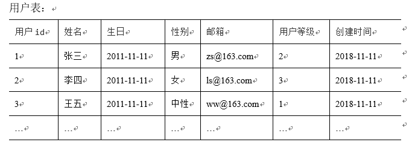
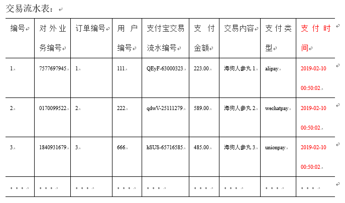
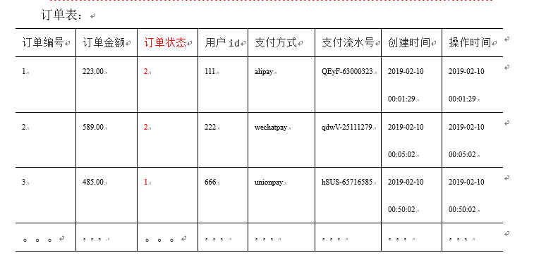
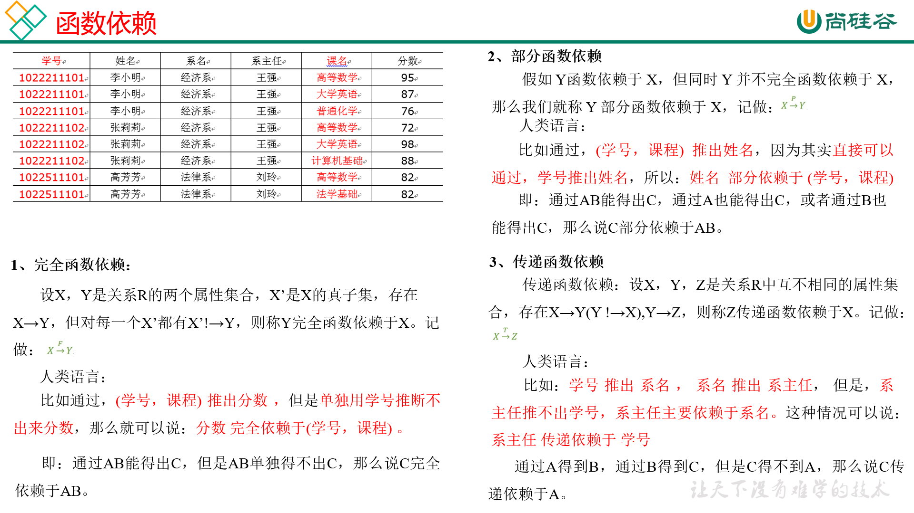
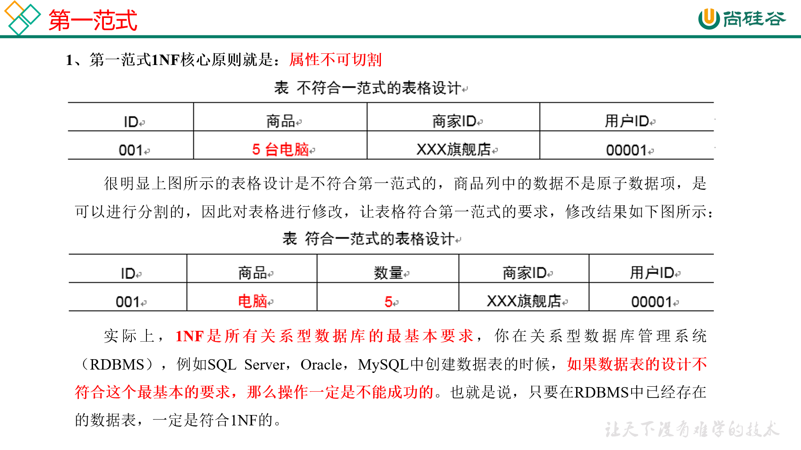
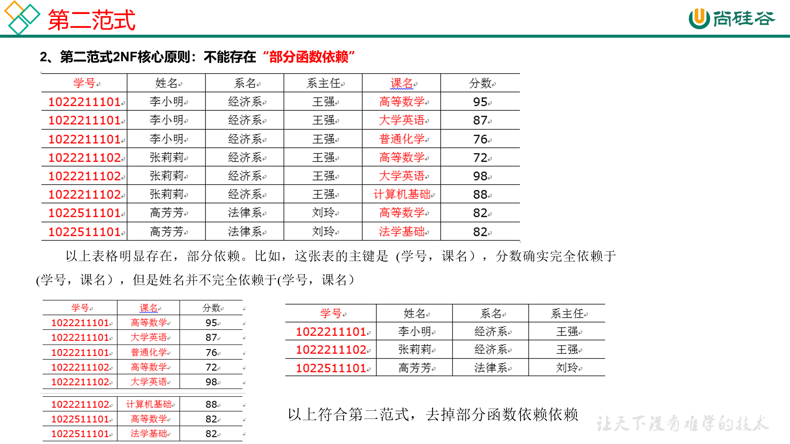
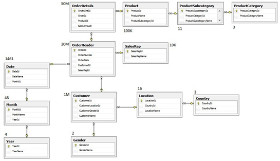
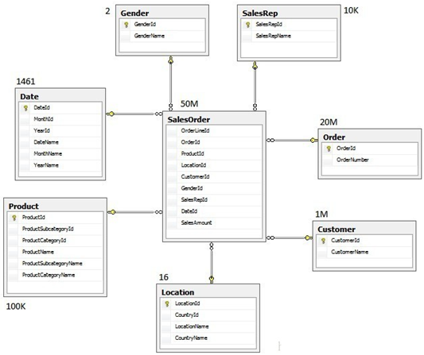
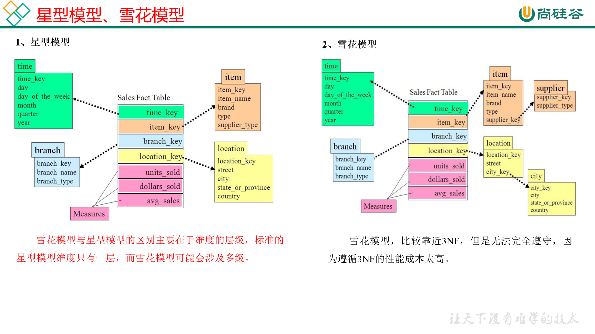
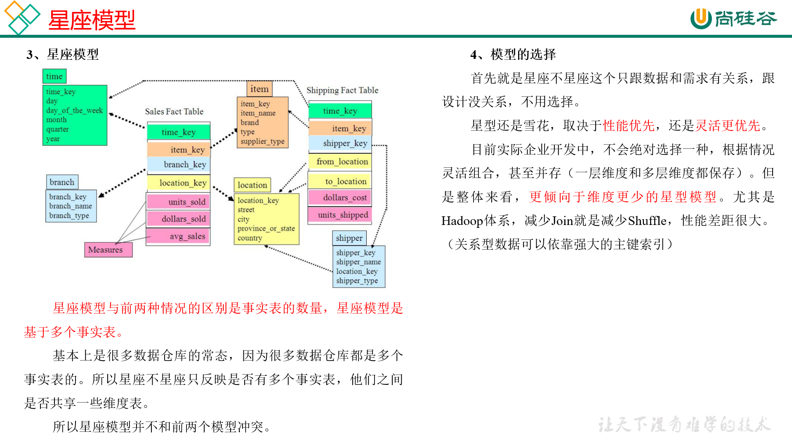

# 02. 数仓理论

## 2.1 表的分类

### 2.1.1 实体表

实体表，一般是指一个现实存在的业务对象，比如用户，商品，商家，销售员等等。
用户表：

### 2.1.2 维度表

维度表，一般是指对应一些业务状态，编号的解释表。也可以称之为**码表**。

比如地区表，订单状态，支付方式，审批状态，商品分类等等。

### 2.1.3 事务型事实表

事务型事实表，一般指随着业务发生不断产生的数据。特点是一旦发生不会再变化。

一般比如，交易流水，操作日志，出库入库记录等等。
交易流水表：

### 2.1.4 周期型事实表

周期型事实表，一般指随着业务发生不断产生的数据。

与事务型不同的是，数据会随着业务周期性的推进而变化。

比如订单，其中订单状态会周期性变化。再比如，请假、贷款申请，随着批复状态在周期性变化。

## 2.2 同步策略

数据同步策略的类型包括：全量表、增量表、新增及变化表、拉链表
	全量表：存储完整的数据。
	增量表：存储新增加的数据。
	新增及变化表：存储新增加的数据和变化的数据。
	拉链表：对新增及变化表做**定期合并**。

### 2.2.1 实体表同步策略

实体表：比如用户，商品，商家，销售员等
实体表数据量比较小：通常可以做每日全量，就是每天存一份完整数据。即**每日全量**。

### 2.2.2 维度表同步策略

维度表：比如订单状态，审批状态，商品分类
维度表数据量比较小：通常可以做每日全量，就是每天存一份完整数据。即**每日全量**。
说明：
1）针对可能会有变化的状态数据可以存储**每日全量**。
2）没变化的客观世界的维度（比如性别，地区，民族，政治成分，鞋子尺码）**可以只存一份固定值**。

### 2.2.3 事务型事实表同步策略

事务型事实表：比如，交易流水，操作日志，出库入库记录等。
因为数据不会变化，而且数据量巨大，所以每天只同步新增数据即可，所以可以做成**每日增量表，即每日创建一个分区存储**。

### 2.2.4 周期型事实表同步策略

周期型事实表：比如，订单、请假、贷款申请等
这类表从数据量的角度，**存每日全量的话，数据量太大，冗余也太大。如果用每日增量的话无法反应数据变化**。

每日新增及变化量，包括了当日的新增和修改。一般来说这个表，足够计算大部分当日数据的。但是这种依然无法解决能够得到某一个历史时间点（时间切片）的切片数据。 

所以**要用利用每日新增和变化表，制作一张拉链表**，以方便的取到某个时间切片的快照数据。所以我们需要得到每日新增及变化量。

## 2.3 范式理论

### 2.3.1 范式概念

关系型数据库设计时，遵照一定的规范要求，目的在于降低数据的冗余性，目前业界范式有：第一范式(1NF)、第二范式(2NF)、第三范式(3NF)、巴斯-科德范式(BCNF)、第四范式(4NF)、第五范式(5NF)。

范式可以理解为一张数据表的表结构，符合的设计标准的级别。

使用范式的根本目的是：
1）减少数据冗余，尽量让每个数据只出现一次。
2）保证数据一致性

缺点是获取数据时，需要通过Join拼接出最后的数据。

### 2.3.2 函数依赖

### 2.3.3 三个范式区分

### 2.4 关系建模与维度建模

1. 关系模型

关系模型主要应用与OLTP系统中，为了保证数据的一致性以及避免冗余，所以大部分业务系统的表都是遵循第三范式的。

2. 维度模型

维度模型主要应用于OLAP系统中，因为关系模型虽然冗余少，但是在大规模数据，**跨表分析统计查询过程中，会造成多表关联，这会大大降低执行效率。**

### 2.5 雪花模型、 星型模型 和 星座模型

