# 01. linux 搭建

[TOC]

## 1.1 Linux 安装

### 1.1.1 回车选择第一个开始安装配置

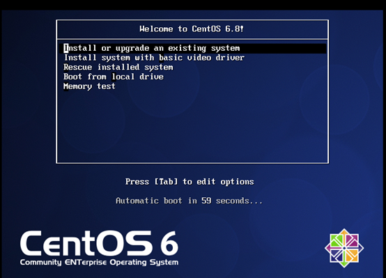

### 1.1.2 是否对CD媒体进行测试，直接跳过Skip


### 1.1.3 CentOS欢迎页面，直接点击Next


### 1.1.4 选择简体中文进行安装
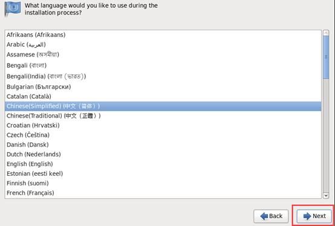

### 1.1.5 选择语音键盘
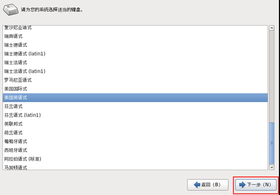

### 1.1.6 选择存储设备

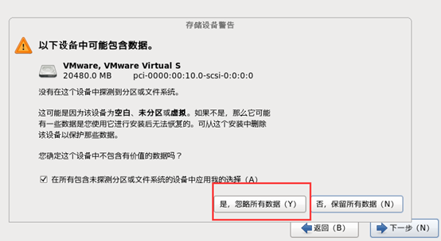

### 1.1.7 给计算机起名
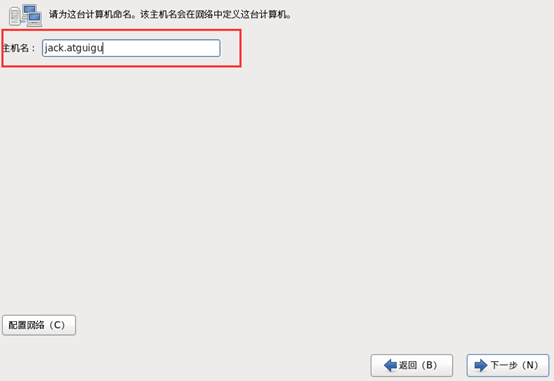

### 1.1.8 设置网络环境
安装成功后再设置。

### 1.1.9 选择时区
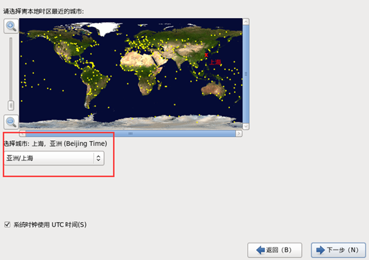

### 1.1.10 设置root密码
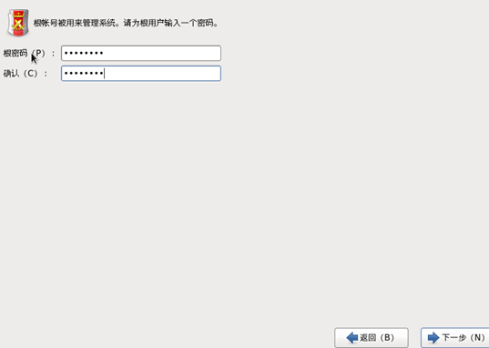

### 1.1.11 硬盘分区
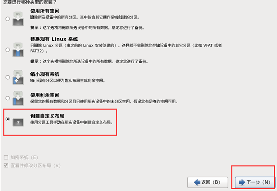
#### 1.1.11.1 根分区新建
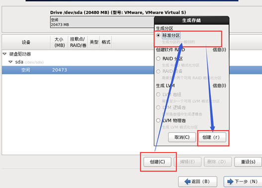

#### 1.1.11.2 创建Boot 分区
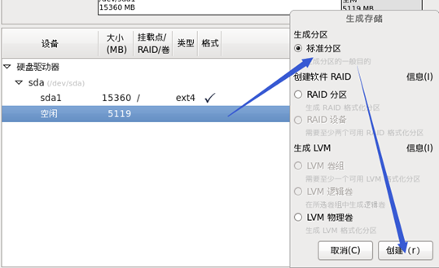
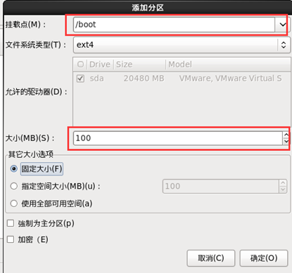
#### 1.1.11.3 swap分区
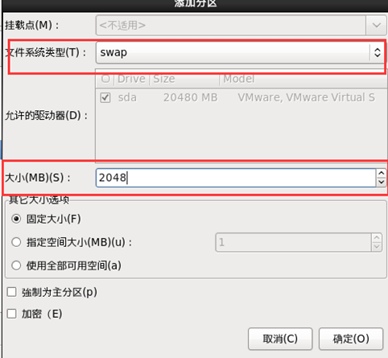

#### 1.1.11.4 分区完成
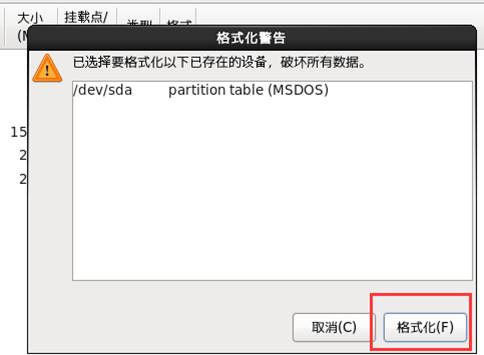

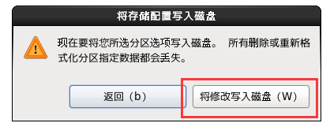

### 1.1.12 程序引导，直接下一步
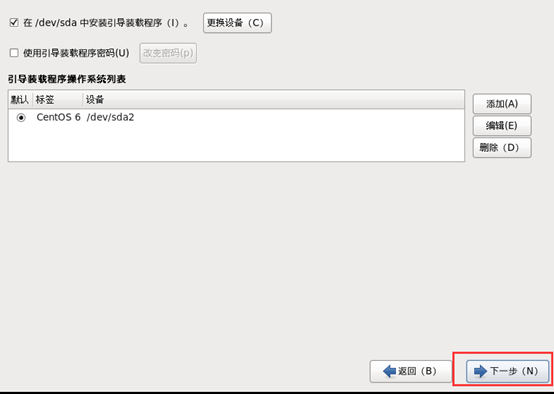

### 1.1.13 现在定制系统软件
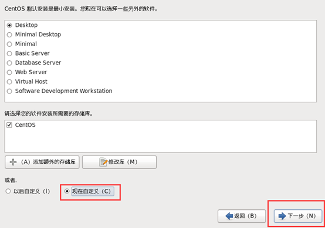
#### 1.1.13.1 web服务

#### 1.1.13.2 可扩展文件系统支持

#### 1.1.13.3 基本系统

#### 1.1.13.4 应用程序
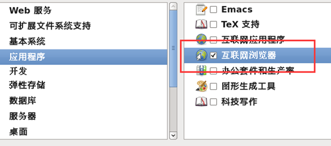
#### 1.1.13.5 开发、弹性存储、数据库、服务器
<font color="red">可以都不勾，有需要，以后使用中有需要再手动安装</font>

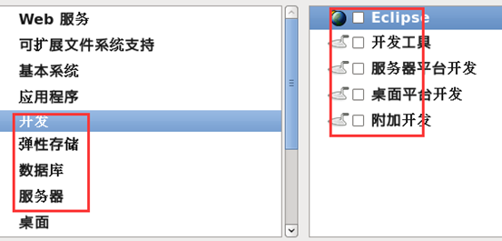
#### 1.1.13.6 桌面
除了KDE，其他都选就可以了
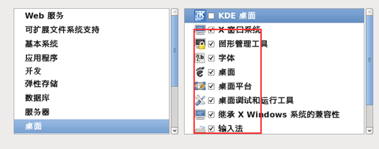
#### 1.1.13.7 语音支持
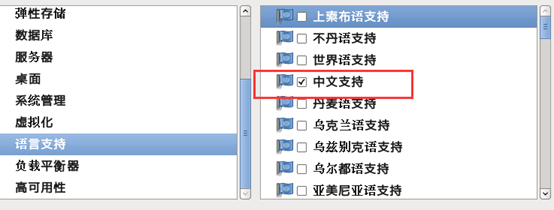
#### 1.1.13.8 系统管理、虚拟化、负载平衡器、高可用性可以都不选

### 1.1.14 完成配置，开始安装CentOS


### 1.1.15 等待安装完成，等待等待等待等待……20分钟左右
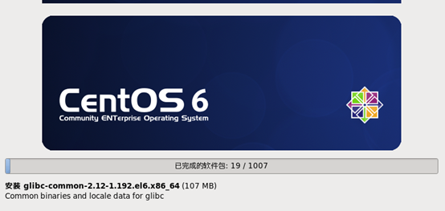

### 1.1.16 安装完成，重新引导
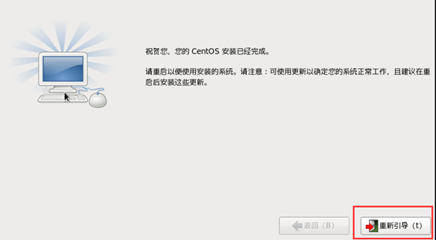

### 1.1.17 引导欢迎页面


### 1.1.18 许可证
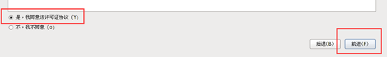

### 1.1.19 创建用户，可以先不创建，用root账户登录就行
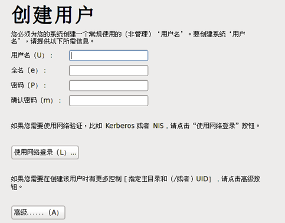
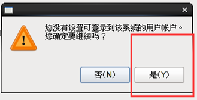

### 1.1.20 时间和日期
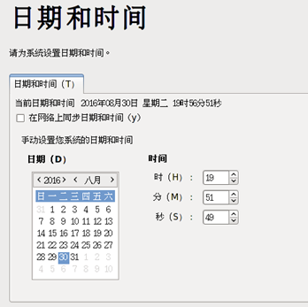

### 1.1.21 Kdump, 去掉

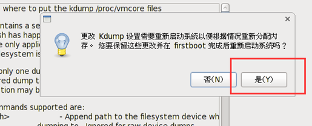

### 1.1.22 重启后用root登录
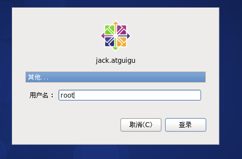


## 1.2 VMTools 安装

### 1.2.1先启动CentOS并成功登录


### 1.2.2 选择虚拟机菜单栏--安装VMware tools
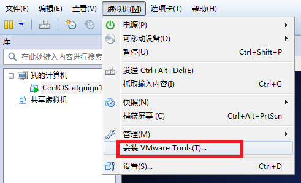

### 1.2.3 光驱自动挂载VMTools
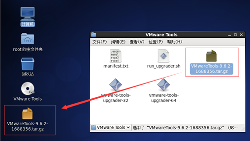

### 1.2.4 右键解压VMwaretools-9.6.2-1688356.tar.gz，进入文件夹并确认看到vmware-install.pl文件
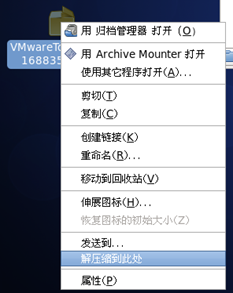
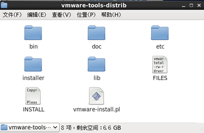

### 1.2.5 运行vmware-install.pl文件
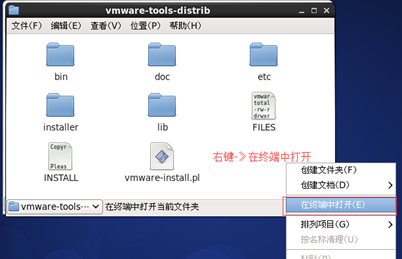
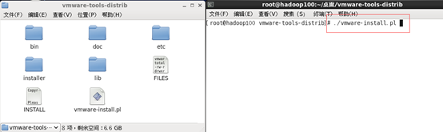
最后用“./vmware-install.pl”命令来运行该安装程序，然后根据屏幕提示一路回车。到此整个安装过程算是完成了。

### 1.2.6 安装完成
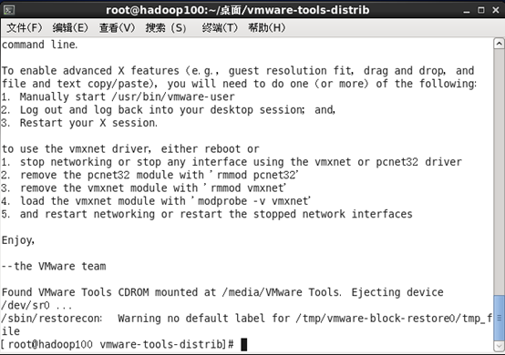

### 1.2.7 重启CentOS


## 1.3 网络配置和系统管理操作

### 1.3.1 查看网络IP和网关
#### 1.3.1.1 查看虚拟网络编辑器
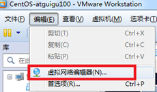
#### 1.3.1.2 修改ip地址
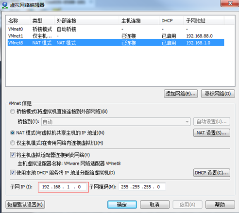
#### 1.3.1.3 查看网关
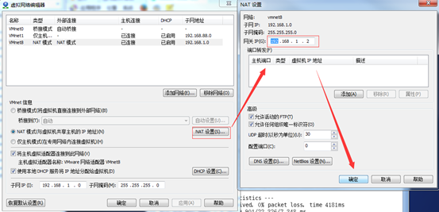
#### 1.3.1.4 查看windows环境的中VMnet8网络配置
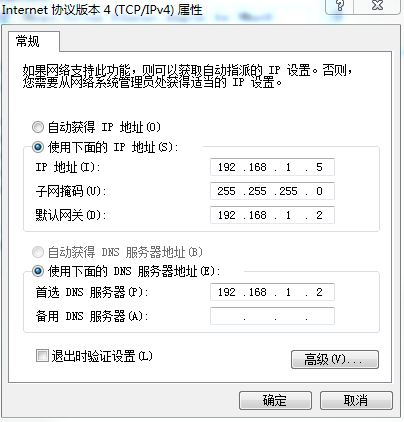

### 1.3.2 配置网络IP地址
#### 1.3.2.1 ifconfig 配置网络接口
```shell
ifconfig :network interfaces configuring网络接口配置

ifconfig		（功能描述：显示所有网络接口的配置信息）

[root@hadoop100 桌面]# ifconfig
```
#### 1.3.2.2 ping 测试网络连通性
```shell
ping 目的主机	（功能描述：测试当前服务器是否可以连接目的主机）

[root@hadoop100 桌面]# ping www.baidu.com
```
#### 1.3.2.3 修改IP地址
1. 修改IP地址
```shell
[root@hadoop100 桌面]#vim /etc/sysconfig/network-scripts/ifcfg-eth0
```
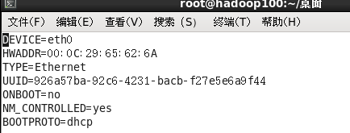

```conf
以下标红的项必须修改，有值的按照下面的值修改，没有该项的要增加。
DEVICE=eth0                #接口名（设备,网卡）
HWADDR=00:0C:2x:6x:0x:xx   #MAC地址 
TYPE=Ethernet               #网络类型（通常是Ethemet）
UUID=926a57ba-92c6-4231-bacb-f27e5e6a9f44  #随机id
#系统启动的时候网络接口是否有效（yes/no）
ONBOOT=yes                
# IP的配置方法[none|static|bootp|dhcp]（引导时不使用协议|静态分配IP|BOOTP协议|DHCP协议）
BOOTPROTO=static      
#IP地址
IPADDR=192.168.1.101   
#网关  
GATEWAY=192.168.1.2      
#域名解析器
DNS1=192.168.1.2

```
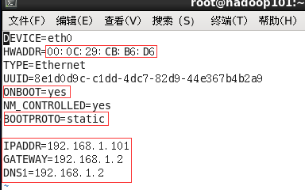
2. service network restart

3.  如果报错，reboot，重启虚拟机

### 1.3.3 配置主机名

1. hostname 显示和设计系统主机名称

```shell
[root@hadoop100 桌面]# hostname
```
2. 修改主机名称
编辑/etc/sysconfig/network文件

```shell
[root@hadoop100 桌面]# vi /etc/sysconfig/network
```
文件中内容
NETWORKING=yes
NETWORKING_IPV6=no
HOSTNAME= <font color= "red">hadoop100
注意：主机名称不要有“_”下划线</font>

3. hosts
```shell
[root@hadoop100 桌面]# vim /etc/hosts
添加如下内容

192.168.1.100 hadoop100
192.168.1.101 hadoop101
192.168.1.102 hadoop102
192.168.1.103 hadoop103
192.168.1.104 hadoop104
192.168.1.105 hadoop105
192.168.1.106 hadoop106
192.168.1.107 hadoop107
192.168.1.108 hadoop108

```
4. 重启
5. 修改本机 hosts

### 1.3.4 关闭防火墙
```shell
查看防火墙状态
[root@hadoop100 桌面]# service iptables status
临时关闭防火墙
[root@hadoop100桌面]# service iptables stop
设置开机时关闭防火墙
[root@hadoop100桌面]# chkconfig iptables off


```

### 1.4 创建用户

1. 创建一般用户 atguigu
```shell
useradd atguigu
passwd atguigu
```

2. 在/opt目录下创建 software module 文件夹

```shell
mkdir /opt/software /opt/module
chown atguigu:atguigu /opt/software /opt/module
```

3. 将用户加入到sudoers

```shell
vim /etc/sudoers

    atguigu ALL=(ALL)       NOPASSWD: ALL
    :wq!强制保存
```


### 1.5 克隆虚拟机
1．关闭要被克隆的虚拟机
2．找到克隆选项，如图1-112所示
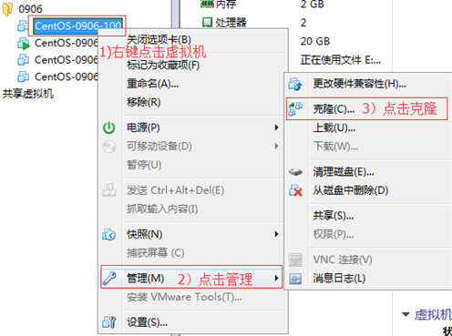
3．欢迎页面
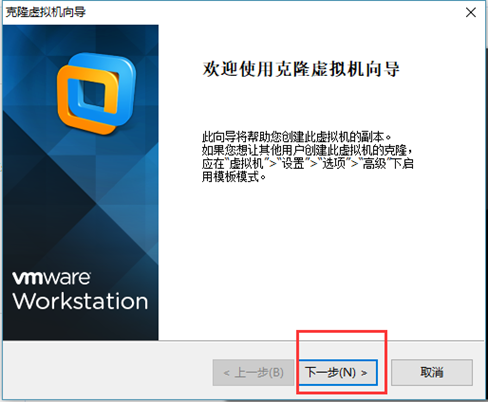
4．克隆虚拟机
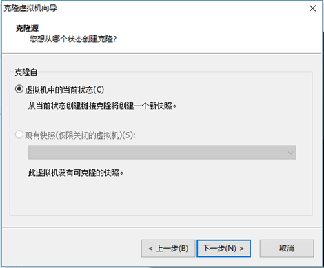
5．设置创建完整克隆
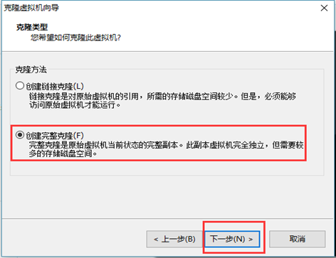
6．设置克隆的虚拟机名称和存储位置
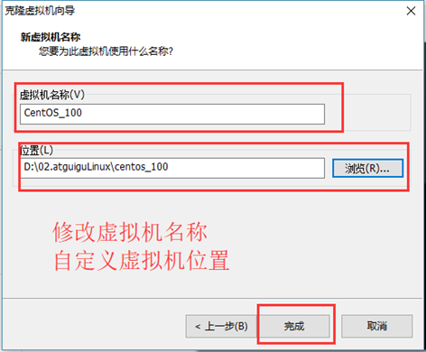
7．等待正在克隆
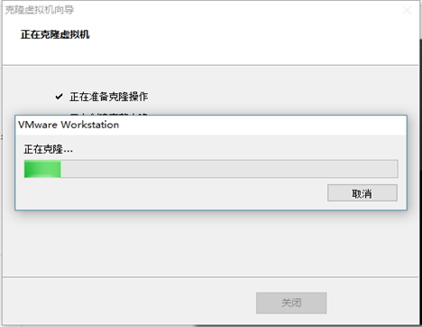
8．点击关闭，完成克隆
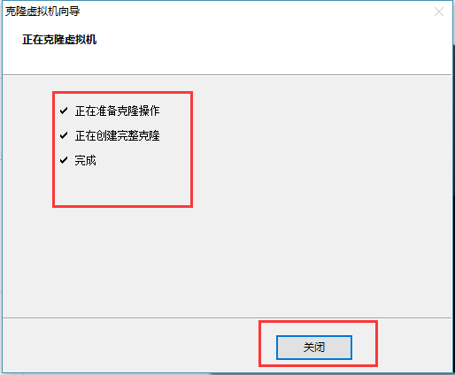
9. 修改克隆后虚拟机的ip
```shell
[root@hadoop101 /]# vim /etc/udev/rules.d/70-persistent-net.rules
```
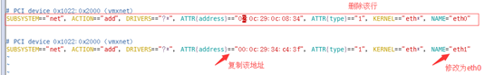
10．修改IP地址
```shell
[root@hadoop101 /]# vim /etc/sysconfig/network-scripts/ifcfg-eth0
```
（1）把复制的物理ip地址更新
HWADDR=00:0C:2x:6x:0x:xx   #MAC地址 
（2）修改成你想要的ip
IPADDR=192.168.1.101      #IP地址
11．修改主机名称
12．重新启动服务器
