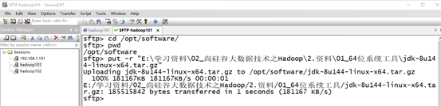
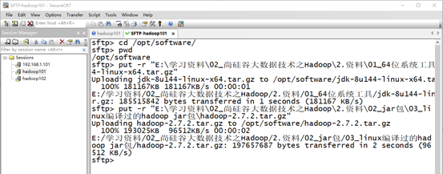
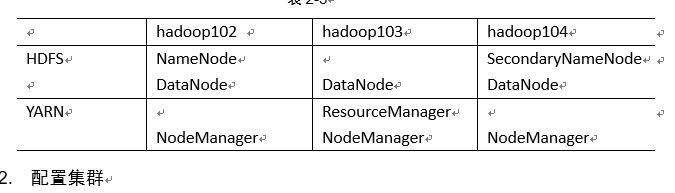
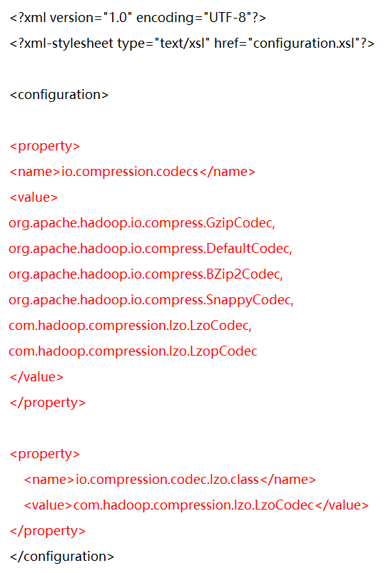
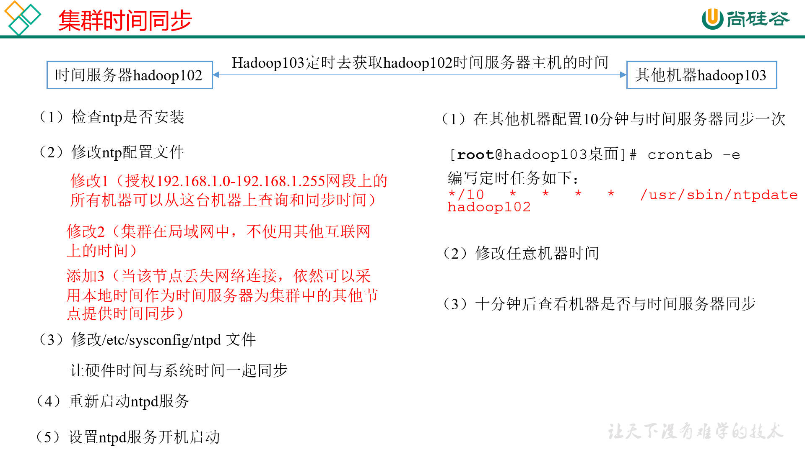
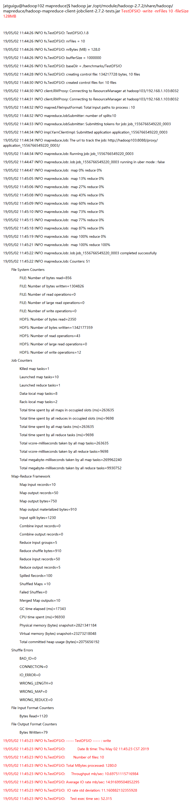
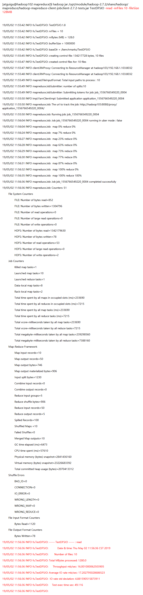

# 02. hadoop搭建 --完全分布式运行模式

[TOC]

## 2.1 虚拟机准备

### 2.1.1 克隆虚拟机

### 2.1.2 修改克隆虚拟机的静态ip

### 2.1.3 修改主机名

### 2.1.4 关闭防火墙

### 2.1.5 创建atguigu用户

### 2.1.6 配置atguigu用户具有root权限 （详见01）

### 2.1.7 在/opt 目录下创建文件夹

```shell
[atguigu@hadoop101 opt]$ sudo mkdir module
[atguigu@hadoop101 opt]$ sudo mkdir software
```

## 2.2 安装JDK

### 2.2.1 卸载现有JDK
1）查询是否安装Java软件：
```shell
[atguigu@hadoop101 opt]$ rpm -qa | grep java
```
（2）如果安装的版本低于1.7，卸载该JDK：
```shell
[atguigu@hadoop101 opt]$ sudo rpm -e 软件包
```
（3）查看JDK安装路径：
```shell
[atguigu@hadoop101 ~]$ which java
```

### 2.2.2 jdk
1. 上传jdk



2. 检查是否导入成功

```shell
[atguigu@hadoop101 opt]$ cd software/
[atguigu@hadoop101 software]$ ls

hadoop-2.7.2.tar.gz  jdk-8u144-linux-x64.tar.gz
```

3. 解压到 `/opt/module` 目录下
```shell
[atguigu@hadoop101 software]$ tar -zxvf jdk-8u144-linux-x64.tar.gz -C /opt/module/
```

4. 配置jdk 环境变量
（1）先获取JDK路径
```shell
[atguigu@hadoop101 jdk1.8.0_144]$ pwd
/opt/module/jdk1.8.0_144
```
（2）打开/etc/profile文件
```shell
[atguigu@hadoop101 software]$ sudo vi /etc/profile
```
在profile文件末尾添加JDK路径
```profile
#JAVA_HOME
export JAVA_HOME=/opt/module/jdk1.8.0_144
export PATH=$PATH:$JAVA_HOME/bin
```
（3）保存后退出
`:wq`
（4）让修改后的文件生效
```shell
[atguigu@hadoop101 jdk1.8.0_144]$ source /etc/profile
```

5. 测试是否成功
```shell
[atguigu@hadoop101 jdk1.8.0_144]# java -version
java version "1.8.0_144"
```

<font color="red"> 注意：重启（如果java -version可以用就不用重启）</font>
```shell
[atguigu@hadoop101 jdk1.8.0_144]$ sync
[atguigu@hadoop101 jdk1.8.0_144]$ sudo reboot
```

## 2.3 安装Hadoop

### 2.3.1 下载地址
https://archive.apache.org/dist/hadoop/common/hadoop-2.7.2/

### 2.3.2 导入


### 2.3.3 解压
```shell
[atguigu@hadoop101 software]$ tar -zxvf hadoop-2.7.2.tar.gz -C /opt/module/
```

### 2.3.4 修改环境变量
`sudo vi /etc/profile`
```profile
##HADOOP_HOME
export HADOOP_HOME=/opt/module/hadoop-2.7.2
export PATH=$PATH:$HADOOP_HOME/bin
export PATH=$PATH:$HADOOP_HOME/sbin
```

`source /etc/profile`

测试
`[atguigu@hadoop101 hadoop-2.7.2]$ hadoop version`
`Hadoop 2.7.2`
<font color="red"> 重启(如果Hadoop命令不能用再重启)</font>

### 2.3.5 分发脚本
#### 2.3.5.1. SSH 无密码登录

1. 配置SSH

`ssh另一台电脑的ip地址`

<font color="red">ssh连接时出现Host key verification failed的解决方法</font>
```shell
[atguigu@hadoop102 opt] $ ssh 192.168.1.103
The authenticity of host '192.168.1.103 (192.168.1.103)' can't be established.
RSA key fingerprint is cf:1e:de:d7:d0:4c:2d:98:60:b4:fd:ae:b1:2d:ad:06.
Are you sure you want to continue connecting (yes/no)? 
Host key verification failed.
```

解决方案如下：直接输入yes

2. 无密码配置

生成公钥和私钥：
`[atguigu@hadoop102 .ssh]$ ssh-keygen -t rsa`

（3）将公钥拷贝到要免密登录的目标机器上
```shell
[atguigu@hadoop102 .ssh]$ ssh-copy-id hadoop102
[atguigu@hadoop102 .ssh]$ ssh-copy-id hadoop103
[atguigu@hadoop102 .ssh]$ ssh-copy-id hadoop104
```

<font color="red">注意：
还需要在hadoop102上采用root账号，配置一下无密登录到hadoop102、hadoop103、hadoop104；
还需要在hadoop103上采用atguigu账号配置一下无密登录到hadoop102、hadoop103、hadoop104服务器上。
</font>

#### 2.3.5.2 xsync 分发脚本

1. 创建脚本
（a）在/home/atguigu目录下创建bin目录，并在bin目录下xsync创建文件，文件内容如下：
```shell
[atguigu@hadoop102 ~]$ mkdir bin
[atguigu@hadoop102 ~]$ cd bin/
[atguigu@hadoop102 bin]$ touch xsync
[atguigu@hadoop102 bin]$ vi xsync
```

2. 代码内容

```bash
#!/bin/bash
#1 获取输入参数个数，如果没有参数，直接退出
pcount=$#
if((pcount==0)); then
echo no args;
exit;
fi

#2 获取文件名称
p1=$1
fname=`basename $p1`
echo fname=$fname

#3 获取上级目录到绝对路径
pdir=`cd -P $(dirname $p1); pwd`
echo pdir=$pdir

#4 获取当前用户名称
user=`whoami`

#5 循环
for((host=103; host<105; host++)); do
        echo ------------------- hadoop$host --------------
        rsync -rvl $pdir/$fname $user@hadoop$host:$pdir
done
```

3. 修改脚本权限
`[atguigu@hadoop102 bin]$ chmod 777 xsync`

4. 调用分发测试
`[atguigu@hadoop102 bin]$ xsync /home/atguigu/bin`

<font color=red>注意：如果将xsync放到/home/atguigu/bin目录下仍然不能实现全局使用，可以将xsync移动到/usr/local/bin目录下。</font>

## 2.4 hadoop集群配置


配置文件地址

`./etc/hadoop`

1. core-site.xml

```xml
<!-- 指定HDFS中NameNode的地址 -->
<property>
	<name>fs.defaultFS</name>
    <value>hdfs://hadoop102:9000</value>
</property>

<!-- 指定Hadoop运行时产生文件的存储目录 -->
<property>
	<name>hadoop.tmp.dir</name>
	<value>/opt/module/hadoop-2.7.2/data/tmp</value>
</property>
```

2. hadoop-env.sh

```bash
export JAVA_HOME=/opt/module/jdk1.8.0_144
```

3. hdfs-site.xml

```xml
<property>
	<name>dfs.replication</name>
	<value>1</value>
</property>

<!-- 指定Hadoop辅助名称节点主机配置 -->
<property>
    <name>dfs.namenode.secondary.http-address</name>
    <value>hadoop104:50090</value>
</property>
```

3. yarn-env.sh

```bash
export JAVA_HOME=/opt/module/jdk1.8.0_144
```

4. yarn-site.xml

```xml
<!-- Reducer获取数据的方式 -->
<property>
	<name>yarn.nodemanager.aux-services</name>
	<value>mapreduce_shuffle</value>
</property>

<!-- 指定YARN的../../Resource/01_数仓采集/anager的地址 -->/<property>
	<name>yarn.../../resource/01_数仓采集/anager.hostna/e</name>
	<value>hadoop103</value>
</property>
```

5. mapred-env.sh

```bash
export JAVA_HOME=/opt/module/jdk1.8.0_144
```

6. mapred-site.xml

`cp mapred-site.xml.template mapred-site.xml`

```xml
<!-- 指定MR运行在Yarn上 -->
<property>
	<name>mapreduce.framework.name</name>
	<value>yarn</value>
</property>
```

## 2.5 LZO 压缩配置

1. 先下载lzo的jar项目
https://github.com/twitter/hadoop-lzo/archive/master.zip
2. 下载后的文件名是hadoop-lzo-master，它是一个zip格式的压缩包，先进行解压，然后用maven编译。生成hadoop-lzo-0.4.20.jar。
3. 将编译好后的hadoop-lzo-0.4.20.jar 放入hadoop-2.7.2/share/hadoop/common/
4. core-site.xml 配置

```xml
<?xml version="1.0" encoding="UTF-8"?>
<?xml-stylesheet type="text/xsl" href="configuration.xsl"?>

<configuration>

<property>
<name>io.compression.codecs</name>
<value>
org.apache.hadoop.io.compress.GzipCodec,
org.apache.hadoop.io.compress.DefaultCodec,
org.apache.hadoop.io.compress.BZip2Codec,
org.apache.hadoop.io.compress.SnappyCodec,
com.hadoop.compression.lzo.LzoCodec,
com.hadoop.compression.lzo.LzopCodec
</value>
</property>

<property>
    <name>io.compression.codec.lzo.class</name>
    <value>com.hadoop.compression.lzo.LzoCodec</value>
</property>
</configuration>

```

## 2.6 分发

1. java
2. hadoop
3. profile


## 2.7 群起集群

1. 配置slaves
`/opt/module/hadoop-2.7.2/etc/hadoop/slaves
[atguigu@hadoop102 hadoop]$ vi slaves`

```
hadoop102
hadoop103
hadoop104
```

<font color='red'>注意：该文件中添加的内容结尾不允许有空格，文件中不允许有空行。</font>

**xsync 分发**

2. 格式化 NameNode
<font color="red">（注意格式化之前，一定要先停止上次启动的所有namenode和datanode进程，然后再删除data和log数据）</font>

`[atguigu@hadoop102 hadoop-2.7.2]$ bin/hdfs namenode -format`

3. 启动HDFS

`[atguigu@hadoop102 hadoop-2.7.2]$ sbin/start-dfs.sh`

```
[atguigu@hadoop102 hadoop-2.7.2]$ jps
4166 NameNode
4482 Jps
4263 DataNode
[atguigu@hadoop103 hadoop-2.7.2]$ jps
3218 DataNode
3288 Jps
[atguigu@hadoop104 hadoop-2.7.2]$ jps
3221 DataNode
3283 SecondaryNameNode
3364 Jps
```

4. 启动yarn
` [atguigu@hadoop103 hadoop-2.7.2]$ sbin/start-yarn.sh`

<font color="red">
注意：NameNode和../../Resource/01_数仓采集/anger如果不是同一台机/，不能在NameNode上启动 YARN，应该在ResouceManager所在的机器上启动YARN。</font>


### 2.8 集群时间同步


**必须root用户**
1. 检查ntp是否安装
`[root@hadoop102 桌面]# rpm -qa|grep ntp`
2. 修改ntp配置文件
`/etc/ntp.conf`
(1) 修改1（授权192.168.1.0-192.168.1.255网段上的所有机器可以从这台机器上查询和同步时间）
```
#restrict 192.168.1.0 mask 255.255.255.0 nomodify notrap
为
restrict 192.168.1.0 mask 255.255.255.0 nomodify notrap
```
(2) 修改2（集群在局域网中，不使用其他互联网上的时间）
```
server 0.centos.pool.ntp.org iburst
server 1.centos.pool.ntp.org iburst
server 2.centos.pool.ntp.org iburst
server 3.centos.pool.ntp.org iburst

为

#server 0.centos.pool.ntp.org iburst
#server 1.centos.pool.ntp.org iburst
#server 2.centos.pool.ntp.org iburst
#server 3.centos.pool.ntp.org iburst
```
(3) 添加3（当该节点丢失网络连接，依然可以采用本地时间作为时间服务器为集群中的其他节点提供时间同步）
```
server 127.127.1.0
fudge 127.127.1.0 stratum 10
```

3. 修改/etc/sysconfig/ntpd 文件
`[root@hadoop102 桌面]# vim /etc/sysconfig/ntpd`

增加内容如下（让硬件时间与系统时间一起同步）
`SYNC_HWCLOCK=yes`

4. 重启服务
`[root@hadoop102 桌面]# service ntpd start`
`[root@hadoop102 桌面]# chkconfig ntpd on`

1. 其他机器配置
**root用户**
（1）在其他机器配置10分钟与时间服务器同步一次
`[root@hadoop103桌面]# crontab -e`
编写定时任务如下：
```
*/10 * * * * /usr/sbin/ntpdate hadoop102
```
（2）修改任意机器时间
[root@hadoop103桌面]# date -s "2017-9-11 11:11:11"
（3）十分钟后查看机器是否与时间服务器同步
[root@hadoop103桌面]# date
说明：测试的时候可以将10分钟调整为1分钟，节省时间。


### 2.8 基准测试
1）测试HDFS写性能
	测试内容：向HDFS集群写10个128M的文件

`[atguigu@hadoop102 mapreduce]$ hadoop jar /opt/module/hadoop-2.7.2/share/hadoop/mapreduce/hadoop-mapreduce-client-jobclient-2.7.2-tests.jar TestDFSIO -write -nrFiles 10 -fileSize 128MB`


2) 测试HDFS读性能
   测试内容：读取HDFS集群10个128M的文件
`[atguigu@hadoop102 mapreduce]$  hadoop jar /opt/module/hadoop-2.7.2/share/hadoop/mapreduce/hadoop-mapreduce-client-jobclient-2.7.2-tests.jar TestDFSIO -read -nrFiles 10 -fileSize 128MB`


3) 删除测试生成数据

`[atguigu@hadoop102 mapreduce]$ hadoop jar /opt/module/hadoop-2.7.2/share/hadoop/mapreduce/hadoop-mapreduce-client-jobclient-2.7.2-tests.jar TestDFSIO -clean`

4）使用Sort程序评测MapReduce
（1）使用RandomWriter来产生随机数，每个节点运行10个Map任务，每个Map产生大约1G大小的二进制随机数
`[atguigu@hadoop102 mapreduce]$ hadoop jar /opt/module/hadoop-2.7.2/share/hadoop/mapreduce/hadoop-mapreduce-examples-2.7.2.jar randomwriter random-data`
（2）执行Sort程序
`[atguigu@hadoop102 mapreduce]$ hadoop jar /opt/module/hadoop-2.7.2/share/hadoop/mapreduce/hadoop-mapreduce-examples-2.7.2.jar sort random-data sorted-data`
（3）验证数据是否真正排好序了
`[atguigu@hadoop102 mapreduce]$ hadoop jar /opt/module/hadoop-2.7.2/share/hadoop/mapreduce/hadoop-mapreduce-examples-2.7.2.jar testmapredsort -sortInput random-data -sortOutput sorted-data`
