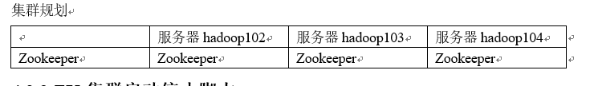

# 03. zookeeper 搭建

[TOC]


## 3.1 zookeeper 安装

### 3.1.1 本地模式安装部署
1．安装前准备
（1）安装Jdk
（2）拷贝Zookeeper安装包到Linux系统下
（3）解压到指定目录
`[atguigu@hadoop102 software]$ tar -zxvf zookeeper-3.4.10.tar.gz -C /opt/module/`

### 3.1.2 分布式安装部署

1. 集群规划
在hadoop102、hadoop103和hadoop104三个节点上部署Zookeeper。

2. 解压安装
(1) 解压Zookeeper安装包到/opt/module/目录下

`[atguigu@hadoop102 software]$ tar -zxvf zookeeper-3.4.10.tar.gz -C /opt/module/`
(2) 同步`/opt/module/zookeeper` 分发到 hadoop103, hadoop104
`[atguigu@hadoop102 module]$ xsync zookeeper-3.4.10/`

3. 配置服务器编号
(1) 在/opt/module/zookeeper-3.4.10/这个目录下创建zkData
`[atguigu@hadoop102 zookeeper-3.4.10]$ mkdir zkData`
(2) 在/opt/module/zookeeper-3.4.10/zkData目录下创建一个myid的文件
`[atguigu@hadoop102 zkData]$ touch myid`
(3) 编辑myid文件
`[atguigu@hadoop102 zkData]$ vi myid`
在文件中添加与server对应的编号：
`2`
(4) 拷贝配置好的zookeeper到其他机器上
`[atguigu@hadoop102 zkData]$ xsync myid`
并分别在hadoop103、hadoop104上修改myid文件中内容为3、4

4. 配置 zoo.cfg 文件
(1) 重命名/opt/module/zookeeper-3.4.10/conf这个目录下的zoo_sample.cfg为zoo.cfg

`[atguigu@hadoop102 conf]$ mv zoo_sample.cfg zoo.cfg`
(2) 打开zoo.cfg文件
`[atguigu@hadoop102 conf]$ vim zoo.cfg`
修改数据存储路径配置
`dataDir=/opt/module/zookeeper-3.4.10/zkData`
增加如下配置
```
#######################cluster##########################
server.2=hadoop102:2888:3888
server.3=hadoop103:2888:3888
server.4=hadoop104:2888:3888
```
(3) 同步zoo.cfg配置文件
`[atguigu@hadoop102 conf]$ xsync zoo.cfg`
（4）配置参数解读
`server.A=B:C:D`。
A是一个数字，表示这个是第几号服务器；
集群模式下配置一个文件myid，这个文件在dataDir目录下，这个文件里面有一个数据就是A的值，Zookeeper启动时读取此文件，拿到里面的数据与zoo.cfg里面的配置信息比较从而判断到底是哪个server。
B是这个服务器的ip地址；
C是这个服务器与集群中的Leader服务器交换信息的端口；
D是万一集群中的Leader服务器挂了，需要一个端口来重新进行选举，选出一个新的Leader，而这个端口就是用来执行选举时服务器相互通信的端口。

## 3.2 集群操作
(1) 分别启动zookeeper
```
[atguigu@hadoop102 zookeeper-3.4.10]$ bin/zkServer.sh start
[atguigu@hadoop103 zookeeper-3.4.10]$ bin/zkServer.sh start
[atguigu@hadoop104 zookeeper-3.4.10]$ bin/zkServer.sh start
```
(2) 查看状态
```
[atguigu@hadoop102 zookeeper-3.4.10]# bin/zkServer.sh status

JMX enabled by default
Using config: /opt/module/zookeeper-3.4.10/bin/../conf/zoo.cfg
Mode: follower
[atguigu@hadoop103 zookeeper-3.4.10]# bin/zkServer.sh status

JMX enabled by default
Using config: /opt/module/zookeeper-3.4.10/bin/../conf/zoo.cfg
Mode: leader
[atguigu@hadoop104 zookeeper-3.4.5]# bin/zkServer.sh status

JMX enabled by default
Using config: /opt/module/zookeeper-3.4.10/bin/../conf/zoo.cfg
Mode: follower
```

## 3.3 ZK集群控制脚本
(1) 在hadoop102的/home/atguigu/bin目录下创建脚本
`[atguigu@hadoop102 bin]$ vim zk.sh`
在脚本中编写如下内容
```bash
#! /bin/bash

case $1 in
"start"){
	for i in hadoop102 hadoop103 hadoop104
	do
		ssh $i "/opt/module/zookeeper-3.4.10/bin/zkServer.sh start"
	done
};;
"stop"){
	for i in hadoop102 hadoop103 hadoop104
	do
		ssh $i "/opt/module/zookeeper-3.4.10/bin/zkServer.sh stop"
	done
};;
"status"){
	for i in hadoop102 hadoop103 hadoop104
	do
		ssh $i "/opt/module/zookeeper-3.4.10/bin/zkServer.sh status"
	done
};;
esac
```
(2) 增加脚本执行权限
`[atguigu@hadoop102 bin]$ chmod 777 zk.sh`

(3) zookeeper 启动脚本
`[atguigu@hadoop102 module]$ zk.sh start`

(4) zookeeper 停止脚本
`[atguigu@hadoop102 module]$ zk.sh stop`


## 3.4 项目经验之Linux 环境变量
1）修改/etc/profile文件：用来设置系统环境参数，比如$PATH. 这里面的环境变量是<font color="red">对系统内所有用户生效<font>。使用bash命令，需要source  /etc/profile一下。
2）修改~/.bashrc文件：<font color="red">针对某一个特定的用户</font>，环境变量的设置只对该用户自己有效。使用bash命令，<font color="red">只要以该用户身份运行命令行就会读取该文件。</font>
3）把/etc/profile里面的环境变量追加到~/.bashrc目录
```
[atguigu@hadoop102 ~]$ cat /etc/profile >> ~/.bashrc
[atguigu@hadoop103 ~]$ cat /etc/profile >> ~/.bashrc
[atguigu@hadoop104 ~]$ cat /etc/profile >> ~/.bashrc
```
