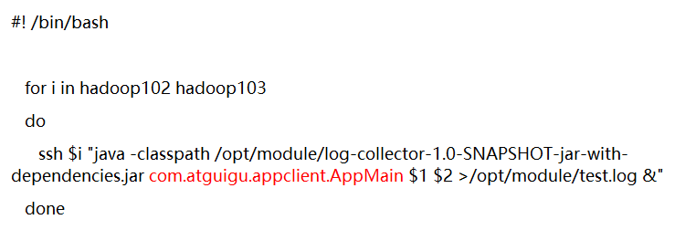

# 04. 日志生成

[TOC]

## 4.1 日志启动

1. 将生成的jar包log-collector-0.0.1-SNAPSHOT-jar-with-dependencies.jar拷贝到hadoop102、服务器上，并同步到hadoop103的/opt/module路径下，

`[atguigu@hadoop102 module]$ xsync log-collector-1.0-SNAPSHOT-jar-with-dependencies.jar`

2. 在hadoop102上执行jar程序
`[atguigu@hadoop102 module]$ java -classpath log-collector-1.0-SNAPSHOT-jar-with-dependencies.jar com.atguigu.appclient.AppMain  >/opt/module/test.log`

3. 在/tmp/logs路径下查看生成的日志文件
```
[atguigu@hadoop102 module]$ cd /tmp/logs/
[atguigu@hadoop102 logs]$ ls
app-2019-02-10.log
```

## 4.2 集群日志生成启动脚本

1. 在/home/atguigu/bin目录下创建脚本lg.sh
`[atguigu@hadoop102 bin]$ vim lg.sh`

2. 在脚本中编写如下内容

```bash
#! /bin/bash

	for i in hadoop102 hadoop103 
	do
		ssh $i "java -classpath /opt/module/log-collector-1.0-SNAPSHOT-jar-with-dependencies.jar com.atguigu.appclient.AppMain $1 $2 >/opt/module/test.log &"
	done
```


3. 修改权限

4. 启动脚本

5. 在`/tmp/logs`中查看生成数据

```
[atguigu@hadoop102 logs]$ ls
app-2019-02-10.log
[atguigu@hadoop103 logs]$ ls
app-2019-02-10.log
```

## 4.3 集群时间同步修改脚本

1. 在/home/atguigu/bin目录下创建脚本dt.sh
`[atguigu@hadoop102 bin]$ vim dt.sh`
2. 在脚本中编写如下内容
```bash
#!/bin/bash

log_date=$1

for i in hadoop102 hadoop103 hadoop104
do
	ssh -t $i "sudo date -s $log_date"
done
```
说明（ssh -t）：
https://www.cnblogs.com/kevingrace/p/6110842.html
3. 修改脚本执行权限
`[atguigu@hadoop102 bin]$ chmod 777 dt.sh`
4. 启动脚本
`[atguigu@hadoop102 bin]$ dt.sh 2019-2-10`

## 4.4 集群所有进程查看脚本
1. 在/home/atguigu/bin目录下创建脚本xcall.sh
`[atguigu@hadoop102 bin]$ vim xcall.sh`

2. 在脚本中编写如下内容

```bash
#! /bin/bash

for i in hadoop102 hadoop103 hadoop104
do
        echo --------- $i ----------
        ssh $i "$*"
done
```

3. 修改脚本执行权限

`[atguigu@hadoop102 bin]$ chmod 777 xcall.sh`

