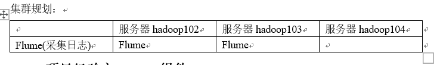
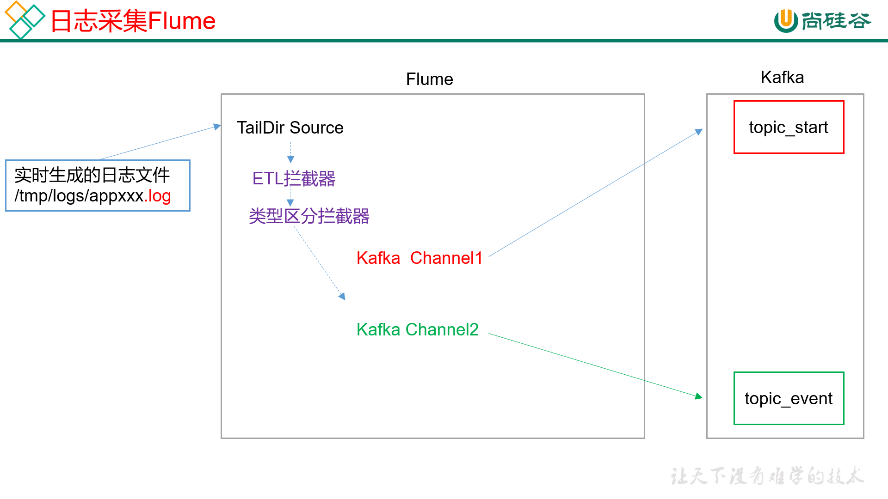
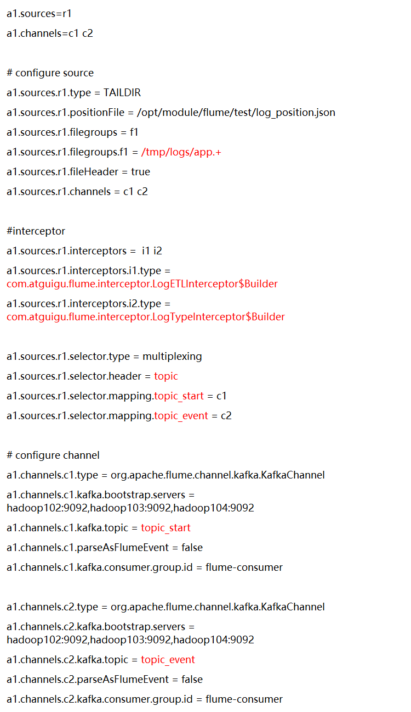
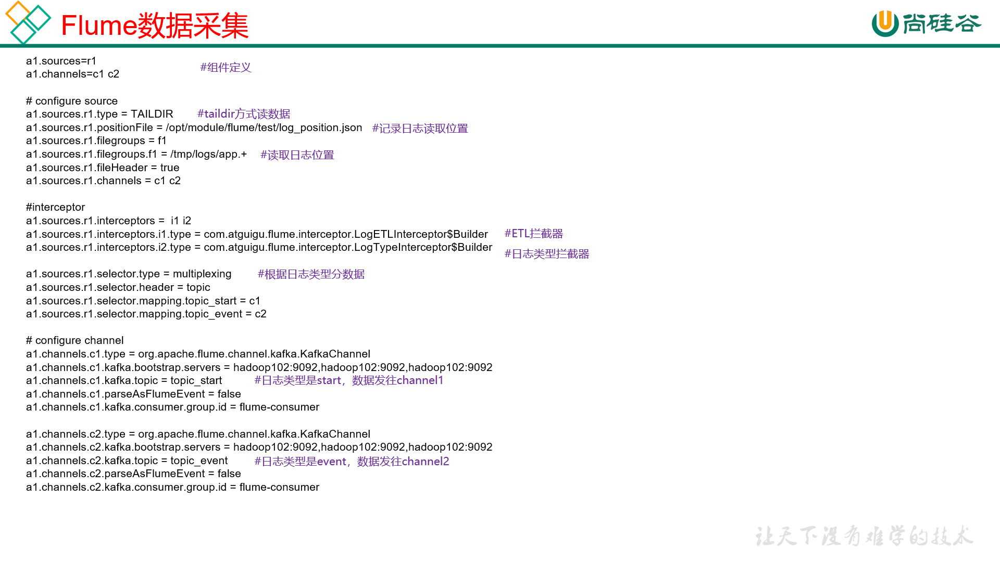
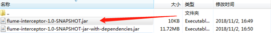

# 05. flume搭建

[TOC]


## 5.1 flume 安装

### 5.1.1 安装地址
1） Flume官网地址
http://flume.apache.org/
2）文档查看地址
http://flume.apache.org/FlumeUserGuide.html
3）下载地址
http://archive.apache.org/dist/flume/

### 5.1.2 安装部署

1）将apache-flume-1.7.0-bin.tar.gz上传到linux的/opt/software目录下
2）解压apache-flume-1.7.0-bin.tar.gz到/opt/module/目录下
`[atguigu@hadoop102 software]$ tar -zxf apache-flume-1.7.0-bin.tar.gz -C /opt/module/`
3）修改apache-flume-1.7.0-bin的名称为flume
`[atguigu@hadoop102 module]$ mv apache-flume-1.7.0-bin flume`
4） 将flume/conf下的flume-env.sh.template文件修改为flume-env.sh，并配置flume-env.sh文件
`[atguigu@hadoop102 conf]$ mv flume-env.sh.template flume-env.sh`
`[atguigu@hadoop102 conf]$ vi flume-env.sh`
```
export JAVA_HOME=/opt/module/jdk1.8.0_144
```

## 5.2 日志采集flume 配置

### 5.2.1 flume配置分析


Flume直接读log日志的数据，log日志的格式是app-yyyy-mm-dd.log。

### 5.2.2 file-flume-kafka.conf
1）在`/opt/module/flume/conf`目录下创建file-flume-kafka.conf文件
`[atguigu@hadoop102 conf]$ vim file-flume-kafka.conf`
在文件配置如下内容

```conf
a1.sources=r1
a1.channels=c1 c2

# configure source
a1.sources.r1.type = TAILDIR
a1.sources.r1.positionFile = /opt/module/flume/test/log_position.json
a1.sources.r1.filegroups = f1
a1.sources.r1.filegroups.f1 = /tmp/logs/app.+
a1.sources.r1.fileHeader = true
a1.sources.r1.channels = c1 c2

#interceptor
a1.sources.r1.interceptors =  i1 i2
a1.sources.r1.interceptors.i1.type = com.atguigu.flume.interceptor.LogETLInterceptor$Builder
a1.sources.r1.interceptors.i2.type = com.atguigu.flume.interceptor.LogTypeInterceptor$Builder

a1.sources.r1.selector.type = multiplexing
a1.sources.r1.selector.header = topic
a1.sources.r1.selector.mapping.topic_start = c1
a1.sources.r1.selector.mapping.topic_event = c2

# configure channel
a1.channels.c1.type = org.apache.flume.channel.kafka.KafkaChannel
a1.channels.c1.kafka.bootstrap.servers = hadoop102:9092,hadoop103:9092,hadoop104:9092
a1.channels.c1.kafka.topic = topic_start
a1.channels.c1.parseAsFlumeEvent = false
a1.channels.c1.kafka.consumer.group.id = flume-consumer

a1.channels.c2.type = org.apache.flume.channel.kafka.KafkaChannel
a1.channels.c2.kafka.bootstrap.servers = hadoop102:9092,hadoop103:9092,hadoop104:9092
a1.channels.c2.kafka.topic = topic_event
a1.channels.c2.parseAsFlumeEvent = false
a1.channels.c2.kafka.consumer.group.id = flume-consumer
```
注意：<font color="red"> com.atguigu.flume.interceptor.LogETLInterceptor和com.atguigu.flume.interceptor.LogTypeInterceptor是自定义的拦截器的全类名。需要根据用户自定义的拦截器做相应修改。</font>



### 5.2.3 拦截器
本项目中自定义了两个拦截器，分别是：ETL拦截器、日志类型区分拦截器。

1）创建Maven工程flume-interceptor
2）创建包名：com.atguigu.flume.interceptor
3）在pom.xml文件中添加如下配置

```xml
<dependencies>
    <dependency>
        <groupId>org.apache.flume</groupId>
        <artifactId>flume-ng-core</artifactId>
        <version>1.7.0</version>
    </dependency>
</dependencies>

<build>
    <plugins>
        <plugin>
            <artifactId>maven-compiler-plugin</artifactId>
            <version>2.3.2</version>
            <configuration>
                <source>1.8</source>
                <target>1.8</target>
            </configuration>
        </plugin>
        <plugin>
            <artifactId>maven-assembly-plugin</artifactId>
            <configuration>
                <descriptorRefs>
                    <descriptorRef>jar-with-dependencies</descriptorRef>
                </descriptorRefs>
            </configuration>
            <executions>
                <execution>
                    <id>make-assembly</id>
                    <phase>package</phase>
                    <goals>
                        <goal>single</goal>
                    </goals>
                </execution>
            </executions>
        </plugin>
    </plugins>
</build>

```

1. ETL 拦截器

ETL拦截器主要用于，过滤时间戳不合法和Json数据不完整的日志

在com.atguigu.flume.interceptor包下创建LogETLInterceptor类名

(1)`Flume ETL拦截器LogETLInterceptor`

```java
package com.atguigu.flume.interceptor;

import org.apache.flume.Context;
import org.apache.flume.Event;
import org.apache.flume.interceptor.Interceptor;

import java.nio.charset.Charset;
import java.util.ArrayList;
import java.util.List;

public class LogETLInterceptor implements Interceptor {

    @Override
    public void initialize() {

    }

    @Override
    public Event intercept(Event event) {

        // 1 获取数据
        byte[] body = event.getBody();
        String log = new String(body, Charset.forName("UTF-8"));

        // 2 判断数据类型并向Header中赋值
        if (log.contains("start")) {
            if (LogUtils.validateStart(log)){
                return event;
            }
        }else {
            if (LogUtils.validateEvent(log)){
                return event;
            }
        }

        // 3 返回校验结果
        return null;
    }

    @Override
    public List<Event> intercept(List<Event> events) {

        ArrayList<Event> interceptors = new ArrayList<>();

        for (Event event : events) {
            Event intercept1 = intercept(event);

            if (intercept1 != null){
                interceptors.add(intercept1);
            }
        }

        return interceptors;
    }

    @Override
    public void close() {

    }

    public static class Builder implements Interceptor.Builder{

        @Override
        public Interceptor build() {
            return new LogETLInterceptor();
        }

        @Override
        public void configure(Context context) {

        }
    }
}
```

(2)`Flume日志过滤工具类`
```java
package com.atguigu.flume.interceptor;
import org.apache.commons.lang.math.NumberUtils;

public class LogUtils {

    public static boolean validateEvent(String log) {
        // 服务器时间 | json
        // 1549696569054 | {"cm":{"ln":"-89.2","sv":"V2.0.4","os":"8.2.0","g":"M67B4QYU@gmail.com","nw":"4G","l":"en","vc":"18","hw":"1080*1920","ar":"MX","uid":"u8678","t":"1549679122062","la":"-27.4","md":"sumsung-12","vn":"1.1.3","ba":"Sumsung","sr":"Y"},"ap":"weather","et":[]}

        // 1 切割
        String[] logContents = log.split("\\|");

        // 2 校验
        if(logContents.length != 2){
            return false;
        }

        //3 校验服务器时间
        if (logContents[0].length()!=13 || !NumberUtils.isDigits(logContents[0])){
            return false;
        }

        // 4 校验json
        if (!logContents[1].trim().startsWith("{") || !logContents[1].trim().endsWith("}")){
            return false;
        }

        return true;
    }

    public static boolean validateStart(String log) {
 // {"action":"1","ar":"MX","ba":"HTC","detail":"542","en":"start","entry":"2","extend1":"","g":"S3HQ7LKM@gmail.com","hw":"640*960","l":"en","la":"-43.4","ln":"-98.3","loading_time":"10","md":"HTC-5","mid":"993","nw":"WIFI","open_ad_type":"1","os":"8.2.1","sr":"D","sv":"V2.9.0","t":"1559551922019","uid":"993","vc":"0","vn":"1.1.5"}

        if (log == null){
            return false;
        }

        // 校验json
        if (!log.trim().startsWith("{") || !log.trim().endsWith("}")){
            return false;
        }

        return true;
    }
}

```

2. 分类拦截器

日志类型区分拦截器主要用于，将启动日志和事件日志区分开来，方便发往Kafka的不同Topic。

```java
package com.atguigu.flume.interceptor;

import org.apache.flume.Context;
import org.apache.flume.Event;
import org.apache.flume.interceptor.Interceptor;

import java.nio.charset.Charset;
import java.util.ArrayList;
import java.util.List;
import java.util.Map;

public class LogTypeInterceptor implements Interceptor {
    @Override
    public void initialize() {

    }

    @Override
    public Event intercept(Event event) {

        // 区分日志类型：   body  header
        // 1 获取body数据
        byte[] body = event.getBody();
        String log = new String(body, Charset.forName("UTF-8"));

        // 2 获取header
        Map<String, String> headers = event.getHeaders();

        // 3 判断数据类型并向Header中赋值
        if (log.contains("start")) {
            headers.put("topic","topic_start");
        }else {
            headers.put("topic","topic_event");
        }

        return event;
    }

    @Override
    public List<Event> intercept(List<Event> events) {

        ArrayList<Event> interceptors = new ArrayList<>();

        for (Event event : events) {
            Event intercept1 = intercept(event);

            interceptors.add(intercept1);
        }

        return interceptors;
    }

    @Override
    public void close() {

    }

    public static class Builder implements  Interceptor.Builder{

        @Override
        public Interceptor build() {
            return new LogTypeInterceptor();
        }

        @Override
        public void configure(Context context) {

        }
    }
}
```

3. 打包
拦截器打包之后，只需要单独包，不需要将依赖的包上传。打包之后要放入Flume的lib文件夹下面。


4. 上传

需要先将打好的包放入到hadoop102的/opt/module/flume/lib文件夹下面。

```
[atguigu@hadoop102 lib]$ ls | grep interceptor
flume-interceptor-1.0-SNAPSHOT.jar
```

分发Flume到hadoop103、hadoop104

5. 启动
`[atguigu@hadoop102 flume]$ bin/flume-ng agent --name a1 --conf-file conf/file-flume-kafka.conf &`


### 5.3 日志采集flume 集群脚本

1）在/home/atguigu/bin目录下创建脚本f1.sh
`[atguigu@hadoop102 bin]$ vim f1.sh`
在脚本中填写如下内容
```bash
#! /bin/bash

case $1 in
"start"){
        for i in hadoop102 hadoop103
        do
                echo " --------启动 $i 采集flume-------"
                ssh $i "nohup /opt/module/flume/bin/flume-ng agent --conf-file /opt/module/flume/conf/file-flume-kafka.conf --name a1 -Dflume.root.logger=INFO,LOGFILE >/dev/null 2>&1 &"
        done
};;	
"stop"){
        for i in hadoop102 hadoop103
        do
                echo " --------停止 $i 采集flume-------"
                ssh $i "ps -ef | grep file-flume-kafka | grep -v grep |awk '{print \$2}' | xargs kill"
        done

};;
esac
```
