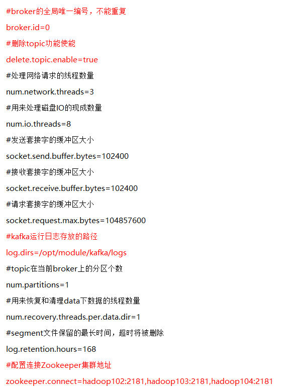

# 06. kafka搭建

[TOC]

## 6.1 kafka 集群搭建

### 6.1.1 集群规划

| hadoop102 | hadoop103 | hadoop104 |
|---------- | --------- | --------- |
|    zk     |     zk    |     zk    |
|   kafka   |   kafka   |    kafka  |

### 6.1.2 kafka 安装

1. 解压安装包
`[atguigu@hadoop102 software]$ tar -zxvf kafka_2.11-0.11.0.0.tgz -C /opt/module/`

2. 修改压缩后文件名称
`[atguigu@hadoop102 module]$ mv kafka_2.11-0.11.0.0/ kafka`

### 6.1.3 kafka 配置
1. 在/opt/module/kafka目录下创建logs文件夹
`[atguigu@hadoop102 kafka]$ mkdir logs`
2. 修改配置文件
`[atguigu@hadoop102 kafka]$ cd config/`
`[atguigu@hadoop102 config]$ vi server.properties`


```properties
#broker的全局唯一编号，不能重复
broker.id=0
#删除topic功能使能
delete.topic.enable=true
#处理网络请求的线程数量
num.network.threads=3
#用来处理磁盘IO的现成数量
num.io.threads=8
#发送套接字的缓冲区大小
socket.send.buffer.bytes=102400
#接收套接字的缓冲区大小
socket.receive.buffer.bytes=102400
#请求套接字的缓冲区大小
socket.request.max.bytes=104857600
#kafka运行日志存放的路径	
log.dirs=/opt/module/kafka/logs
#topic在当前broker上的分区个数
num.partitions=1
#用来恢复和清理data下数据的线程数量
num.recovery.threads.per.data.dir=1
#segment文件保留的最长时间，超时将被删除
log.retention.hours=168
#配置连接Zookeeper集群地址
zookeeper.connect=hadoop102:2181,hadoop103:2181,hadoop104:2181

```

3. 配置环境变量

`[atguigu@hadoop102 module]$ sudo vi /etc/profile`
```
#KAFKA_HOME
export KAFKA_HOME=/opt/module/kafka
export PATH=$PATH:$KAFKA_HOME/bin
```

`[atguigu@hadoop102 module]$ source /etc/profile`

4. 分发安装包

5. 分别在hadoop103和hadoop104上修改配置文件/opt/module/kafka/config/server.properties中的<font color='red'>broker.id=1、broker.id=2</font>

**注：broker.id不得重复**

## 6.2 kafka 集群启动停止脚本

1. `/home/atguigu/bin` 目录下创建kf.sh
```bash
#! /bin/bash

case $1 in
"start"){
        for i in hadoop102 hadoop103 hadoop104
        do
                echo " --------启动 $i Kafka-------"
                # 用于KafkaManager监控
                ssh $i "export JMX_PORT=9988 && /opt/module/kafka/bin/kafka-server-start.sh -daemon /opt/module/kafka/config/server.properties "
        done
};;
"stop"){
        for i in hadoop102 hadoop103 hadoop104
        do
                echo " --------停止 $i Kafka-------"
                ssh $i "/opt/module/kafka/bin/kafka-server-stop.sh stop"
        done
};;
esac
```
<font color="red"> 说明：启动Kafka时要先开启JMX端口，是用于后续KafkaManager监控。</font>

2. 增加脚本执行权限

3. kafka群起脚本
    `kf.sh start`

4. kafka群停脚本
    `kf.sh stop`

## 6.3 查看topic 列表
`[atguigu@hadoop102 kafka]$ bin/kafka-topics.sh --zookeeper hadoop102:2181 --list`

## 6.4 创建kafka topic
进入到`/opt/module/kafka/`目录下分别创建：启动日志主题、事件日志主题。

1. 创建启动日志主题
`[atguigu@hadoop102 kafka]$ bin/kafka-topics.sh --zookeeper hadoop102:2181,hadoop103:2181,hadoop104:2181  --create --replication-factor 1 --partitions 1 --topic topic_start`
2. 创建事件日志主题
`[atguigu@hadoop102 kafka]$ bin/kafka-topics.sh --zookeeper hadoop102:2181,hadoop103:2181,hadoop104:2181  --create --replication-factor 1 --partitions 1 --topic topic_event`


## 6.5 删除kafka topic

1. 删除启动日志主题
`[atguigu@hadoop102 kafka]$ bin/kafka-topics.sh --delete --zookeeper hadoop102:2181,hadoop103:2181,hadoop104:2181 --topic topic_start`
2. 删除事件日志主题
`[atguigu@hadoop102 kafka]$ bin/kafka-topics.sh --delete --zookeeper hadoop102:2181,hadoop103:2181,hadoop104:2181 --topic topic_event`

## 6.7 kafka 生产消息
```
[atguigu@hadoop102 kafka]$ bin/kafka-console-producer.sh \
--broker-list hadoop102:9092 --topic topic_start
>hello world
>atguigu  atguigu
```

## 6.8 kafka 消费消息
```
[atguigu@hadoop102 kafka]$ bin/kafka-console-consumer.sh \
--zookeeper hadoop102:2181 --from-beginning --topic topic_start
```

--from-beginning：会把主题中以往所有的数据都读取出来。根据业务场景选择是否增加该配置。

## 6.9 kafka manager 安装

Kafka Manager是yahoo的一个Kafka监控管理项目。

1. 下载地址
https://github.com/yahoo/kafka-manager
下载之后编译源码，编译完成后，拷贝出：kafka-manager-1.3.3.22.zip
2. 上传`/opt/module`
3. 解压
`[atguigu@hadoop102 module]$ unzip kafka-manager-1.3.3.22.zip`
4. 进入到/opt/module/kafka-manager-1.3.3.22/conf目录，在application.conf文件中修改kafka-manager.zkhosts
`[atguigu@hadoop102 conf]$ vim application.conf`
修改为：
`kafka-manager.zkhosts="hadoop102:2181,hadoop103:2181,hadoop104:2181"`
5. 启动kafka manager
`[atguigu@hadoop102 kafka-manager-1.3.3.22]$ 
nohup bin/kafka-manager   -Dhttp.port=7456 >/opt/module/kafka-manager-1.3.3.22/start.log 2>&1 &`
6. 浏览器打开http://hadoop102:7456

可以看到这个界面，选择添加 cluster；

我们要配置好Zookeeper的Hosts，Cluster的Name，Kafka的版本，点击确定。

至此，就可以查看整个Kafka集群的状态，包括：Topic的状态、Brokers的状态、Cosumer的状态。
在Kafka的/opt/module/kafka-manager-1.3.3.22/application.home_IS_UNDEFINED 目录下面，可以看到Kafka-Manager的日志。
7. KafkaManager使用
https://blog.csdn.net/u011089412/article/details/87895652

## 6.10 kafka manager 启动停止脚本

1）在/home/atguigu/bin目录下创建脚本km.sh
`[atguigu@hadoop102 bin]$ vim km.sh`
	在脚本中填写如下内容
```bash
#! /bin/bash

case $1 in
"start"){
        echo " -------- 启动 KafkaManager -------"
        nohup /opt/module/kafka-manager-1.3.3.22/bin/kafka-manager   -Dhttp.port=7456 >start.log 2>&1 &
};;
"stop"){
        echo " -------- 停止 KafkaManager -------"
        ps -ef | grep ProdServerStart | grep -v grep |awk '{print $2}' | xargs kill 
};;
esac
```
2）增加脚本执行权限
`[atguigu@hadoop102 bin]$ chmod 777 km.sh`
3）km集群启动脚本
`[atguigu@hadoop102 module]$ km.sh start`
4）km集群停止脚本
`[atguigu@hadoop102 module]$ km.sh stop`

## 6.11 kafka 压力测试
Kafka压测
用Kafka官方自带的脚本，对Kafka进行压测。Kafka压测时，可以查看到哪个地方出现了瓶颈（CPU，内存，网络IO）。一般都是网络IO达到瓶颈。 
kafka-consumer-perf-test.sh
kafka-producer-perf-test.sh
2）Kafka Producer压力测试
（1）在/opt/module/kafka/bin目录下面有这两个文件。我们来测试一下
`[atguigu@hadoop102 kafka]$ bin/kafka-producer-perf-test.sh  --topic test --record-size 100 --num-records 100000 --throughput 1000 --producer-props bootstrap.servers=hadoop102:9092,hadoop103:9092,hadoop104:9092`
说明：record-size是一条信息有多大，单位是字节。num-records是总共发送多少条信息。throughput 是每秒多少条信息。
（2）Kafka会打印下面的信息
```
5000 records sent, 999.4 records/sec (0.10 MB/sec), 1.9 ms avg latency, 254.0 max latency.
5002 records sent, 1000.4 records/sec (0.10 MB/sec), 0.7 ms avg latency, 12.0 max latency.
5001 records sent, 1000.0 records/sec (0.10 MB/sec), 0.8 ms avg latency, 4.0 max latency.
5000 records sent, 1000.0 records/sec (0.10 MB/sec), 0.7 ms avg latency, 3.0 max latency.
5000 records sent, 1000.0 records/sec (0.10 MB/sec), 0.8 ms avg latency, 5.0 max latency.
```
参数解析：本例中一共写入10w条消息，每秒向Kafka写入了0.10MB的数据，平均是1000条消息/秒，每次写入的平均延迟为0.8毫秒，最大的延迟为254毫秒。
3）Kafka Consumer压力测试
Consumer的测试，如果这四个指标（IO，CPU，内存，网络）都不能改变，考虑增加分区数来提升性能。
`[atguigu@hadoop102 kafka]$ bin/kafka-consumer-perf-test.sh --zookeeper hadoop102:2181 --topic test --fetch-size 10000 --messages 10000000 --threads 1`
参数说明：
--zookeeper 指定zookeeper的链接信息
--topic 指定topic的名称
--fetch-size 指定每次fetch的数据的大小
--messages 总共要消费的消息个数
测试结果说明：
start.time, end.time, data.consumed.in.MB, MB.sec, data.consumed.in.nMsg, nMsg.sec
2019-02-19 20:29:07:566, 2019-02-19 20:29:12:170, 9.5368, 2.0714, 100010, 21722.4153
开始测试时间，测试结束数据，最大吞吐率9.5368MB/s，平均每秒消费2.0714MB/s，最大每秒消费100010条，平均每秒消费21722.4153条。

## 6.12 kafka 机器数量计算
Kafka机器数量（经验公式）=2*（峰值生产速度*副本数/100）+1
先要预估一天大概产生多少数据，然后用Kafka自带的生产压测（只测试Kafka的写入速度，保证数据不积压），计算出峰值生产速度。再根据设定的副本数，就能预估出需要部署Kafka的数量。
比如我们采用压力测试测出写入的速度是10M/s一台，峰值的业务数据的速度是50M/s。副本数为2。
Kafka机器数量=2*（50*2/100）+ 1=3台
