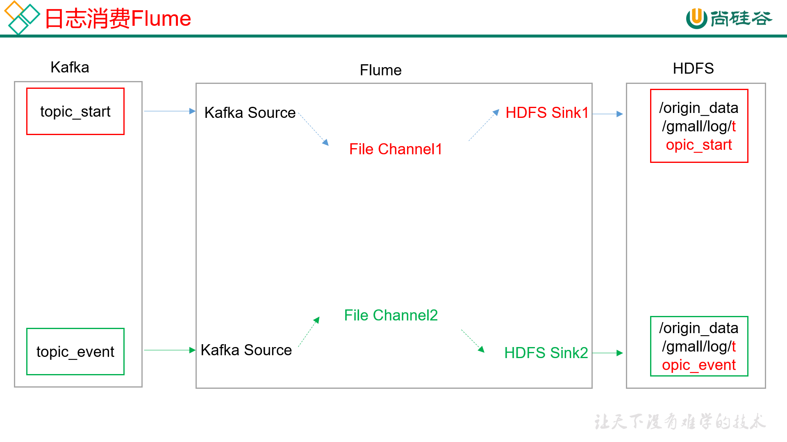

# 07. kafka消费flume

[TOC]
## 7.1. 集群规划


## 7.2 日志消费flume配置

1. Flume配置分析

2. Flume具体配置
在hadoop104的/opt/module/flume/conf目录下创建kafka-flume-hdfs.conf文件
`[atguigu@hadoop104 conf]$ vim kafka-flume-hdfs.conf`
在文件配置如下内容
```conf
## 组件
a1.sources=r1 r2
a1.channels=c1 c2
a1.sinks=k1 k2

## source1
a1.sources.r1.type = org.apache.flume.source.kafka.KafkaSource
a1.sources.r1.batchSize = 5000
a1.sources.r1.batchDurationMillis = 2000
a1.sources.r1.kafka.bootstrap.servers = hadoop102:9092,hadoop103:9092,hadoop104:9092
a1.sources.r1.kafka.topics=topic_start

## source2
a1.sources.r2.type = org.apache.flume.source.kafka.KafkaSource
a1.sources.r2.batchSize = 5000
a1.sources.r2.batchDurationMillis = 2000
a1.sources.r2.kafka.bootstrap.servers = hadoop102:9092,hadoop103:9092,hadoop104:9092
a1.sources.r2.kafka.topics=topic_event

## channel1
a1.channels.c1.type = file
a1.channels.c1.checkpointDir = /opt/module/flume/checkpoint/behavior1
a1.channels.c1.dataDirs = /opt/module/flume/data/behavior1/
a1.channels.c1.maxFileSize = 2146435071
a1.channels.c1.capacity = 1000000
a1.channels.c1.keep-alive = 6

## channel2
a1.channels.c2.type = file
a1.channels.c2.checkpointDir = /opt/module/flume/checkpoint/behavior2
a1.channels.c2.dataDirs = /opt/module/flume/data/behavior2/
a1.channels.c2.maxFileSize = 2146435071
a1.channels.c2.capacity = 1000000
a1.channels.c2.keep-alive = 6

## sink1
a1.sinks.k1.type = hdfs
a1.sinks.k1.hdfs.path = /origin_data/gmall/log/topic_start/%Y-%m-%d
a1.sinks.k1.hdfs.filePrefix = logstart-
a1.sinks.k1.hdfs.round = true
a1.sinks.k1.hdfs.roundValue = 10
a1.sinks.k1.hdfs.roundUnit = second

##sink2
a1.sinks.k2.type = hdfs
a1.sinks.k2.hdfs.path = /origin_data/gmall/log/topic_event/%Y-%m-%d
a1.sinks.k2.hdfs.filePrefix = logevent-
a1.sinks.k2.hdfs.round = true
a1.sinks.k2.hdfs.roundValue = 10
a1.sinks.k2.hdfs.roundUnit = second

## 不要产生大量小文件
a1.sinks.k1.hdfs.rollInterval = 10
a1.sinks.k1.hdfs.rollSize = 134217728
a1.sinks.k1.hdfs.rollCount = 0

a1.sinks.k2.hdfs.rollInterval = 10
a1.sinks.k2.hdfs.rollSize = 134217728
a1.sinks.k2.hdfs.rollCount = 0

## 控制输出文件是原生文件。
a1.sinks.k1.hdfs.fileType = CompressedStream 
a1.sinks.k2.hdfs.fileType = CompressedStream 

a1.sinks.k1.hdfs.codeC = lzop
a1.sinks.k2.hdfs.codeC = lzop

## 拼装
a1.sources.r1.channels = c1
a1.sinks.k1.channel= c1

a1.sources.r2.channels = c2
a1.sinks.k2.channel= c2
```


## 7.3 Flume 内存优化
1. 问题描述：如果启动消费Flume抛出如下异常
ERROR hdfs.HDFSEventSink: process failed
java.lang.OutOfMemoryError: GC overhead limit exceeded
2. 解决方案步骤：
（1）在hadoop102服务器的/opt/module/flume/conf/flume-env.sh文件中增加如下配置
`export JAVA_OPTS="-Xms100m -Xmx2000m -Dcom.sun.management.jmxremote"`
（2）同步配置到hadoop103、hadoop104服务器
`[atguigu@hadoop102 conf]$ xsync flume-env.sh`
3. Flume内存参数设置及优化
JVM heap一般设置为4G或更高，部署在单独的服务器上（4核8线程16G内存）
-Xmx与-Xms最好设置一致，减少内存抖动带来的性能影响，如果设置不一致容易导致频繁fullgc。

## 7.4 flume 组件
1.FileChannel和MemoryChannel区别
MemoryChannel传输数据速度更快，但因为数据保存在JVM的堆内存中，Agent进程挂掉会导致数据丢失，适用于对数据质量要求不高的需求。
FileChannel传输速度相对于Memory慢，但数据安全保障高，Agent进程挂掉也可以从失败中恢复数据。
2.FileChannel优化
通过配置dataDirs指向多个路径，每个路径对应不同的硬盘，增大Flume吞吐量。
官方说明如下：
Comma separated list of directories for storing log files. Using multiple directories on separate disks can improve file channel peformance
checkpointDir和backupCheckpointDir也尽量配置在不同硬盘对应的目录中，保证checkpoint坏掉后，可以快速使用backupCheckpointDir恢复数据
3.Sink：HDFS Sink
（1）HDFS存入大量小文件，有什么影响？
元数据层面：每个小文件都有一份元数据，其中包括文件路径，文件名，所有者，所属组，权限，创建时间等，这些信息都保存在Namenode内存中。所以小文件过多，会占用Namenode服务器大量内存，影响Namenode性能和使用寿命
计算层面：默认情况下MR会对每个小文件启用一个Map任务计算，非常影响计算性能。同时也影响磁盘寻址时间。
（2）HDFS小文件处理
官方默认的这三个参数配置写入HDFS后会产生小文件，hdfs.rollInterval、hdfs.rollSize、hdfs.rollCount
基于以上hdfs.rollInterval=3600，hdfs.rollSize=134217728，hdfs.rollCount =0，hdfs.roundValue=10，hdfs.roundUnit= second几个参数综合作用，效果如下：
 <1> tmp文件在达到128M时会滚动生成正式文件
 <2>tmp文件创建超3600秒时会滚动生成正式文件
举例：在2018-01-01 05:23的时侯sink接收到数据，那会产生如下tmp文件：
/atguigu/20180101/atguigu.201801010620.tmp
即使文件内容没有达到128M，也会在06:23时滚动生成正式文件

## 7.5 日志消费Flume 启动停止脚本

1）在/home/atguigu/bin目录下创建脚本f2.sh
`[atguigu@hadoop102 bin]$ vim f2.sh`
在脚本中填写如下内容
```bash
#! /bin/bash

case $1 in
"start"){
        for i in hadoop104
        do
                echo " --------启动 $i 消费flume-------"
                ssh $i "nohup /opt/module/flume/bin/flume-ng agent --conf-file /opt/module/flume/conf/kafka-flume-hdfs.conf --name a1 -Dflume.root.logger=INFO,LOGFILE >/opt/module/flume/log.txt   2>&1 &"
        done
};;
"stop"){
        for i in hadoop104
        do
                echo " --------停止 $i 消费flume-------"
                ssh $i "ps -ef | grep kafka-flume-hdfs | grep -v grep |awk '{print \$2}' | xargs kill"
        done

};;
esac
```
2）增加脚本执行权限
`[atguigu@hadoop102 bin]$ chmod 777 f2.sh`
3）f2集群启动脚本
`[atguigu@hadoop102 module]$ f2.sh start`
4）f2集群停止脚本
`[atguigu@hadoop102 module]$ f2.sh stop`


