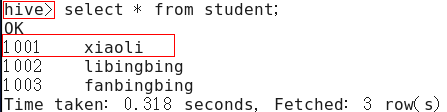

# 01. 数仓搭建

[TOC]

## 1.1 集群规划


## 1.2 Hive & MySQL

### 1.2.1 Hive 安装部署

1. Hive 安装及配置

（1）把apache-hive-1.2.1-bin.tar.gz上传到linux的/opt/software目录下
（2）解压apache-hive-1.2.1-bin.tar.gz到/opt/module/目录下面
`[atguigu@hadoop102 software]$ tar -zxvf apache-hive-1.2.1-bin.tar.gz -C /opt/module/`
（3）修改apache-hive-1.2.1-bin.tar.gz的名称为hive
`[atguigu@hadoop102 module]$ mv apache-hive-1.2.1-bin/ hive`
（4）修改/opt/module/hive/conf目录下的hive-env.sh.template名称为hive-env.sh
`[atguigu@hadoop102 conf]$ mv hive-env.sh.template hive-env.sh`
（5）配置hive-env.sh文件
	（a）配置HADOOP_HOME路径
`export HADOOP_HOME=/opt/module/hadoop-2.7.2`
	（b）配置HIVE_CONF_DIR路径
`export HIVE_CONF_DIR=/opt/module/hive/conf`

2. Hadoop 集群配置
（1）必须启动HDFS和YARN
`[atguigu@hadoop102 hadoop-2.7.2]$ sbin/start-dfs.sh`
`[atguigu@hadoop103 hadoop-2.7.2]$ sbin/start-yarn.sh`
（2）在HDFS上创建/tmp和/user/hive/warehouse两个目录并修改他们的同组权限可写
`[atguigu@hadoop102 hadoop-2.7.2]$ bin/hadoop fs -mkdir /tmp`
`[atguigu@hadoop102 hadoop-2.7.2]$ bin/hadoop fs -mkdir -p /user/hive/warehouse`

`[atguigu@hadoop102 hadoop-2.7.2]$ bin/hadoop fs -chmod g+w /tmp`
`[atguigu@hadoop102 hadoop-2.7.2]$ bin/hadoop fs -chmod g+w /user/hive/warehouse`

3. Hive 基本操作
（1）启动hive
`[atguigu@hadoop102 hive]$ bin/hive`
（2）查看数据库
`hive> show databases;`
（3）打开默认数据库
`hive> use default;`
（4）显示default数据库中的表
`hive> show tables;`
（5）创建一张表
`hive> create table student(id int, name string);`
（6）显示数据库中有几张表
`hive> show tables;`
（7）查看表的结构
`hive> desc student;`
（8）向表中插入数据
`hive> insert into student values(1000,"ss");`
（9）查询表中数据
`hive> select * from student;`
（10）退出hive
`hive> quit;`


### 1.2.2 Mysql 安装部署

1. 安装包准备

(1) 查看mysql是否安装，如果安装了，卸载mysql
	（1）查看
`[root@hadoop102 桌面]# rpm -qa|grep mysql`
`mysql-libs-5.1.73-7.el6.x86_64`
	（2）卸载
`[root@hadoop102 桌面]# rpm -e --nodeps mysql-libs-5.1.73-7.el6.x86_64`
(2)解压mysql-libs.zip文件到当前目录
`[root@hadoop102 software]# unzip mysql-libs.zip`
`[root@hadoop102 software]# ls`
`mysql-libs.zip`
`mysql-libs`
(3)进入到mysql-libs文件夹下
`[root@hadoop102 mysql-libs]# ll`
```
总用量 76048
-rw-r--r--. 1 root root 18509960 3月  26 2015 MySQL-client-5.6.24-1.el6.x86_64.rpm
-rw-r--r--. 1 root root  3575135 12月  1 2013 mysql-connector-java-5.1.27.tar.gz
-rw-r--r--. 1 root root 55782196 3月  26 2015 MySQL-server-5.6.24-1.el6.x86_64.rpm
```

2. 安装Mysql服务器

(1) 安装mysql服务端
`[root@hadoop102 mysql-libs]# rpm -ivh MySQL-server-5.6.24-1.el6.x86_64.rpm`
(2) 查看产生的随机密码
`[root@hadoop102 mysql-libs]# cat /root/.mysql_secret`
OEXaQuS8IWkG19Xs
(3) 查看mysql状态
`[root@hadoop102 mysql-libs]# service mysql status`
(4) 启动mysql
`[root@hadoop102 mysql-libs]# service mysql start`

3. 安装Mysql客户端

(1) 安装mysql客户端
`[root@hadoop102 mysql-libs]# rpm -ivh MySQL-client-5.6.24-1.el6.x86_64.rpm`
(2) 链接mysql
`[root@hadoop102 mysql-libs]# mysql -uroot -pOEXaQuS8IWkG19Xs`
(3) 修改密码
`mysql>SET PASSWORD=PASSWORD('000000');`
(4) 退出mysql
`mysql>exit`

4. Mysql 中 user 表中主机配置

配置只要是root用户+密码，在任何主机上都能登录MySQL数据库。
(1) 进入mysql
`[root@hadoop102 mysql-libs]# mysql -uroot -p000000`
(2) 显示数据库
`mysql>show databases;`
(3) 使用mysql数据库
`mysql>use mysql;`
(4) 展示mysql数据库中的所有表
`mysql>show tables;`
(5) 展示user表的结构
`mysql>desc user;`
(6) 查询user表
`mysql>select User, Host, Password from user;`
(7) 修改user表，把Host表内容修改为%
`mysql>update user set host='%' where host='localhost';`
(8) 删除root用户的其他host
```
mysql>
delete from user where Host='hadoop102';
delete from user where Host='127.0.0.1';
delete from user where Host='::1';
```
(9) 刷新
`mysql>flush privileges;`
(10) 退出
`mysql>quit;`


### 1.2.3 Hive 元数据配置到 Mysql

#### 1.2.3.1 驱动拷贝

1．在/opt/software/mysql-libs目录下解压mysql-connector-java-5.1.27.tar.gz驱动包
`[root@hadoop102 mysql-libs]# tar -zxvf mysql-connector-java-5.1.27.tar.gz`
2．拷贝/opt/software/mysql-libs/mysql-connector-java-5.1.27目录下的mysql-connector-java-5.1.27-bin.jar到/opt/module/hive/lib/
`[root@hadoop102 mysql-connector-java-5.1.27]# cp mysql-connector-java-5.1.27-bin.jar /opt/module/hive/lib/`

#### 1.2.3.2 配置 Metastore 到 Mysql

1．在/opt/module/hive/conf目录下创建一个hive-site.xml
[atguigu@hadoop102 conf]$ vi hive-site.xml
2．根据官方文档配置参数，拷贝数据到hive-site.xml文件中
https://cwiki.apache.org/confluence/display/Hive/AdminManual+MetastoreAdmin
```xml
<?xml version="1.0"?>
<?xml-stylesheet type="text/xsl" href="configuration.xsl"?>
<configuration>
	<property>
	  <name>javax.jdo.option.ConnectionURL</name>
	  <value>jdbc:mysql://hadoop102:3306/metastore?createDatabaseIfNotExist=true</value>
	  <description>JDBC connect string for a JDBC metastore</description>
	</property>

	<property>
	  <name>javax.jdo.option.ConnectionDriverName</name>
	  <value>com.mysql.jdbc.Driver</value>
	  <description>Driver class name for a JDBC metastore</description>
	</property>

	<property>
	  <name>javax.jdo.option.ConnectionUserName</name>
	  <value>root</value>
	  <description>username to use against metastore database</description>
	</property>

	<property>
	  <name>javax.jdo.option.ConnectionPassword</name>
	  <value>000000</value>
	  <description>password to use against metastore database</description>
	</property>
</configuration>
```

3．配置完毕后，如果启动hive异常，可以重新启动虚拟机。（重启后，别忘了启动hadoop集群）

### 1.2.4 Hive 常见属性配置

#### 1.2.4.1 查询后信息显示配置

1）在hive-site.xml文件中添加如下配置信息，就可以实现显示当前数据库，以及查询表的头信息配置。
```xml
<property>
	<name>hive.cli.print.header</name>
	<value>true</value>
</property>

<property>
	<name>hive.cli.print.current.db</name>
	<value>true</value>
</property>
```
2）重新启动hive，对比配置前后差异。
（1）配置前，如图所示

图 配置前

（2）配置后，如图所示

图 配置后

#### 1.2.4.2 Hive 运行日志信息配置

1．Hive的log默认存放在/tmp/atguigu/hive.log目录下（当前用户名下）
2．修改hive的log存放日志到/opt/module/hive/logs
	（1）修改/opt/module/hive/conf/hive-log4j.properties.template文件名称为
hive-log4j.properties
`[atguigu@hadoop102 conf]$ pwd`
`/opt/module/hive/conf`
`[atguigu@hadoop102 conf]$ mv hive-log4j.properties.template hive-log4j.properties`
	（2）在hive-log4j.properties文件中修改log存放位置
`hive.log.dir=/opt/module/hive/logs`


### 1.2.5 修改 hive-site.xml

1）关闭元数据检查
```
[atguigu@hadoop102 conf]$ pwd
/opt/module/hive/conf
[atguigu@hadoop102 conf]$ vim hive-site.xml
```
增加如下配置：
```xml
<property>
    <name>hive.metastore.schema.verification</name>
    <value>false</value>
</property>
```

## 1.3 Hive 运行引擎 Tez

Tez是一个Hive的运行引擎，性能优于MR。为什么优于MR呢？看下图。


用Hive直接编写MR程序，假设有四个有依赖关系的MR作业，上图中，绿色是Reduce Task，云状表示写屏蔽，需要将中间结果持久化写到HDFS。
Tez可以将多个有依赖的作业转换为一个作业，这样只需写一次HDFS，且中间节点较少，从而大大提升作业的计算性能。

### 1.3.1 安装包准备
1）下载tez的依赖包：http://tez.apache.org
2）拷贝apache-tez-0.9.1-bin.tar.gz到hadoop102的/opt/module目录
`[atguigu@hadoop102 module]$ ls`
`apache-tez-0.9.1-bin.tar.gz`
3）解压缩apache-tez-0.9.1-bin.tar.gz
`[atguigu@hadoop102 module]$ tar -zxvf apache-tez-0.9.1-bin.tar.gz`
4）修改名称
`[atguigu@hadoop102 module]$ mv apache-tez-0.9.1-bin/ tez-0.9.1`


### 1.3.2 Hive 中配置 Tez

1）进入到Hive的配置目录：/opt/module/hive/conf
`[atguigu@hadoop102 conf]$ pwd`
`/opt/module/hive/conf`
2）在hive-env.sh文件中添加tez环境变量配置和依赖包环境变量配置
`[atguigu@hadoop102 conf]$ vim hive-env.sh`
添加如下配置


```sh
# Set HADOOP_HOME to point to a specific hadoop install directory
export HADOOP_HOME=/opt/module/hadoop-2.7.2

# Hive Configuration Directory can be controlled by:
export HIVE_CONF_DIR=/opt/module/hive/conf

# Folder containing extra libraries required for hive compilation/execution can be controlled by:
export TEZ_HOME=/opt/module/tez-0.9.1    #是你的tez的解压目录
export TEZ_JARS=""
for jar in `ls $TEZ_HOME |grep jar`; do
    export TEZ_JARS=$TEZ_JARS:$TEZ_HOME/$jar
done
for jar in `ls $TEZ_HOME/lib`; do
    export TEZ_JARS=$TEZ_JARS:$TEZ_HOME/lib/$jar
done

export HIVE_AUX_JARS_PATH=/opt/module/hadoop-2.7.2/share/hadoop/common/hadoop-lzo-0.4.20.jar$TEZ_JARS
```
3）在hive-site.xml文件中添加如下配置，更改hive计算引擎
```xml
<property>
    <name>hive.execution.engine</name>
    <value>tez</value>
</property>
```

### 1.3.3 配置Tez
在Hive的/opt/module/hive/conf下面创建一个tez-site.xml文件
`[atguigu@hadoop102 conf]$ pwd`
`/opt/module/hive/conf`
`[atguigu@hadoop102 conf]$ vim tez-site.xml`
添加如下内容

```xml
<?xml version="1.0" encoding="UTF-8"?>
<?xml-stylesheet type="text/xsl" href="configuration.xsl"?>
<configuration>
<property>
	<name>tez.lib.uris</name>    <value>${fs.defaultFS}/tez/tez-0.9.1,${fs.defaultFS}/tez/tez-0.9.1/lib</value>
</property>
<property>
	<name>tez.lib.uris.classpath</name>    	<value>${fs.defaultFS}/tez/tez-0.9.1,${fs.defaultFS}/tez/tez-0.9.1/lib</value>
</property>
<property>
     <name>tez.use.cluster.hadoop-libs</name>
     <value>true</value>
</property>
<property>
     <name>tez.history.logging.service.class</name>        <value>org.apache.tez.dag.history.logging.ats.ATSHistoryLoggingService</value>
</property>
</configuration>
```

### 1.4 上传 Tez 到集群

1）将/opt/module/tez-0.9.1上传到HDFS的/tez路径
`[atguigu@hadoop102 conf]$ hadoop fs -mkdir /tez`
`[atguigu@hadoop102 conf]$ hadoop fs -put /opt/module/tez-0.9.1/ /tez`
`[atguigu@hadoop102 conf]$ hadoop fs -ls /tez /tez/tez-0.9.1`

### 1.5 测试

1）启动Hive
`[atguigu@hadoop102 hive]$ bin/hive`
2）创建LZO表
```sql
hive (default)> create table student(
id int,
name string);
```
3）向表中插入数据
```sql
hive (default)> insert into student values(1,"zhangsan");
4）如果没有报错就表示成功了
hive (default)> select * from student;
1       zhangsan
```

### 1.6 小结

运行Tez时检查到用过多内存而被NodeManager杀死进程问题：
```
Caused by: org.apache.tez.dag.api.SessionNotRunning: TezSession has already shutdown. Application application_1546781144082_0005 failed 2 times due to AM Container for appattempt_1546781144082_0005_000002 exited with  exitCode: -103
For more detailed output, check application tracking page:http://hadoop103:8088/cluster/app/application_1546781144082_0005Then, click on links to logs of each attempt.
Diagnostics: Container [pid=11116,containerID=container_1546781144082_0005_02_000001] is running beyond virtual memory limits. Current usage: 216.3 MB of 1 GB physical memory used; 2.6 GB of 2.1 GB virtual memory used. Killing container.
```
这种问题是从机上运行的Container试图使用过多的内存，而被NodeManager kill掉了。
```
[摘录] The NodeManager is killing your container. It sounds like you are trying to use hadoop streaming which is running as a child process of the map-reduce task. The NodeManager monitors the entire process tree of the task and if it eats up more memory than the maximum set in mapreduce.map.memory.mb or mapreduce.reduce.memory.mb respectively, we would expect the Nodemanager to kill the task, otherwise your task is stealing memory belonging to other containers, which you don't want.
```

解决办法

方案一：或者是关掉虚拟内存检查。我们选这个，修改yarn-site.xml
```xml
<property>
<name>yarn.nodemanager.vmem-check-enabled</name>
<value>false</value>
</property>
```
方案二：mapred-site.xml中设置Map和Reduce任务的内存配置如下：(value中实际配置的内存需要根据自己机器内存大小及应用情况进行修改)
```xml
<property>
　　<name>mapreduce.map.memory.mb</name>
　　<value>1536</value>
</property>
<property>
　　<name>mapreduce.map.java.opts</name>
　　<value>-Xmx1024M</value>
</property>
<property>
　　<name>mapreduce.reduce.memory.mb</name>
　　<value>3072</value>
</property>
<property>
　　<name>mapreduce.reduce.java.opts</name>
　　<value>-Xmx2560M</value>
</property>
```
