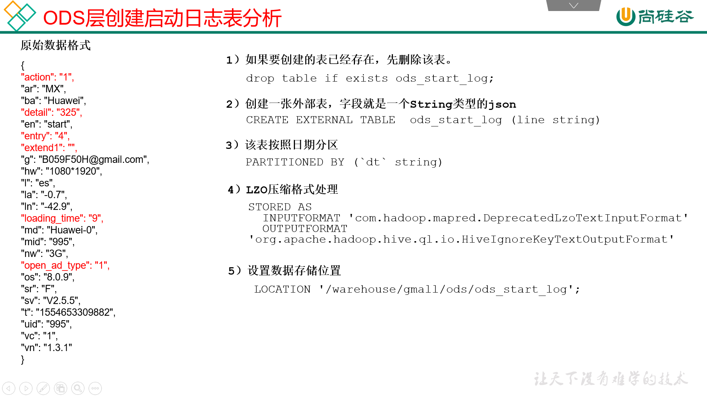
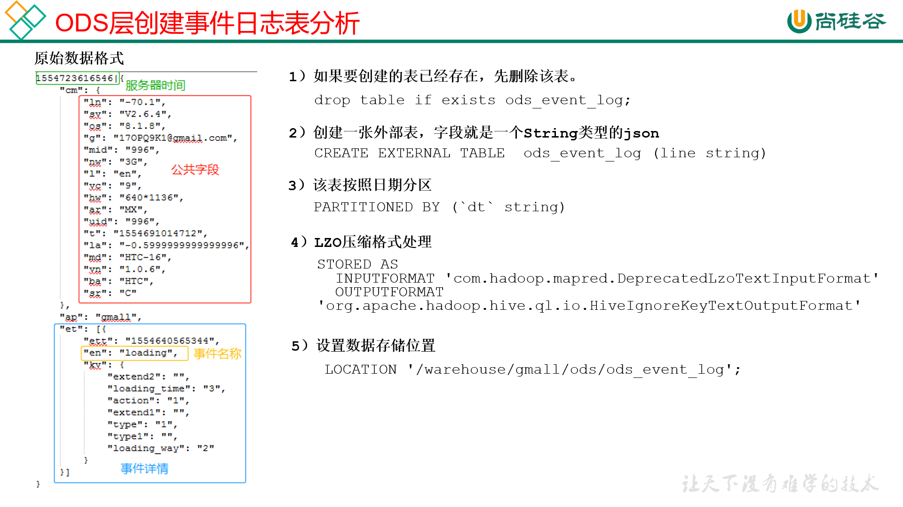

# 02. ODS层

## 2.1 创建数据库

1. 创建gmall数据库
`hive (default)> create database gmall;`
说明：如果数据库存在且有数据，需要强制删除时执行：
`drop database gmall cascade;`
2. 使用gmall数据库
`hive (default)> use gmall;`

## 2.2 ODS 层
原始数据层，存放原始数据，直接加载原始日志、数据，数据保持原貌不做处理。

### 2.2.1 创建启动日志表 ods_start_log


1. 创建输入数据是lzo输出是text，支持json解析的分区表

```sql
hive (gmall)> 
drop table if exists ods_start_log;
CREATE EXTERNAL TABLE ods_start_log (`line` string)
PARTITIONED BY (`dt` string)
STORED AS
  INPUTFORMAT 'com.hadoop.mapred.DeprecatedLzoTextInputFormat'
  OUTPUTFORMAT 'org.apache.hadoop.hive.ql.io.HiveIgnoreKeyTextOutputFormat'
LOCATION '/warehouse/gmall/ods/ods_start_log';
```
说明Hive的LZO压缩：https://cwiki.apache.org/confluence/display/Hive/LanguageManual+LZO

2. 加载数据
```sql
hive (gmall)> 
load data inpath '/origin_data/gmall/log/topic_start/2019-02-10' into table gmall.ods_start_log partition(dt='2019-02-10');
```
注意：时间格式都配置成YYYY-MM-DD格式，这是Hive默认支持的时间格式

3. 查看是否加载成功

`hive (gmall)> select * from ods_start_log limit 2;`


### 2.2.2 创建事件日志表ods_event_log



1. 创建输入数据是lzo输出是text，支持json解析的分区表
```sql
hive (gmall)> 
drop table if exists ods_event_log;
CREATE EXTERNAL TABLE ods_event_log(`line` string)
PARTITIONED BY (`dt` string)
STORED AS
  INPUTFORMAT 'com.hadoop.mapred.DeprecatedLzoTextInputFormat'
  OUTPUTFORMAT 'org.apache.hadoop.hive.ql.io.HiveIgnoreKeyTextOutputFormat'
LOCATION '/warehouse/gmall/ods/ods_event_log';

```

2. 加载数据

```sql
hive (gmall)> 
load data inpath '/origin_data/gmall/log/topic_event/2019-02-10' into table gmall.ods_event_log partition(dt='2019-02-10');
```

3. 查看是否成功

```sql
hive (gmall)> select * from ods_event_log limit 2;
```

### 2.2.3 Shell中单引号和双引号区别

1. 在/home/atguigu/bin创建一个test.sh文件
`[atguigu@hadoop102 bin]$ vim test.sh `
在文件中添加如下内容

```bash
#!/bin/bash
do_date=$1

echo '$do_date'
echo "$do_date"
echo "'$do_date'"
echo '"$do_date"'
echo `date`
```
2. 查看执行结果

```
[atguigu@hadoop102 bin]$ test.sh 2019-02-10
$do_date
2019-02-10
'2019-02-10'
"$do_date"
2019年 05月 02日 星期四 21:02:08 CST
```

3. 总结

（1）单引号不取变量值
（2）双引号取变量值
（3）反引号`，执行引号中命令
（4）双引号内部嵌套单引号，取出变量值
（5）单引号内部嵌套双引号，不取出变量值


### 2.2.4 ODS 层加载数据脚本

1. 在hadoop102的/home/atguigu/bin目录下创建脚本
`[atguigu@hadoop102 bin]$ vim ods_log.sh`

在脚本中编写如下内容

```bash
#!/bin/bash

# 定义变量方便修改
APP=gmall
hive=/opt/module/hive/bin/hive

# 如果是输入的日期按照取输入日期；如果没输入日期取当前时间的前一天
if [ -n "$1" ] ;then
   do_date=$1
else 
   do_date=`date -d "-1 day" +%F`
fi 

echo "===日志日期为 $do_date==="
sql="
load data inpath '/origin_data/gmall/log/topic_start/$do_date' into table "$APP".ods_start_log partition(dt='$do_date');

load data inpath '/origin_data/gmall/log/topic_event/$do_date' into table "$APP".ods_event_log partition(dt='$do_date');
"

$hive -e "$sql"
```

说明1：
[ -n 变量值 ] 判断变量的值，是否为空
-- 变量的值，非空，返回true
-- 变量的值，为空，返回false
说明2：
查看date命令的使用，[atguigu@hadoop102 ~]$ date --help

2. 增加脚本执行权限
`[atguigu@hadoop102 bin]$ chmod 777 ods_log.sh`
3）脚本使用
`[atguigu@hadoop102 module]$ ods_log.sh 2019-02-11`
4. 查看导入数据
```sql
hive (gmall)> 
select * from ods_start_log where dt='2019-02-11' limit 2;
select * from ods_event_log where dt='2019-02-11' limit 2;
```
5. 脚本执行时间
企业开发中一般在每日凌晨30分~1点
