# 6. 业务需求

[TOC]

## 6.1 需求一： 用户活跃主题

### 6.1.1 DWS 层

目标：统计当日、当周、当月活动的每个设备明细

### 6.1.1.1 每日活跃设备明细

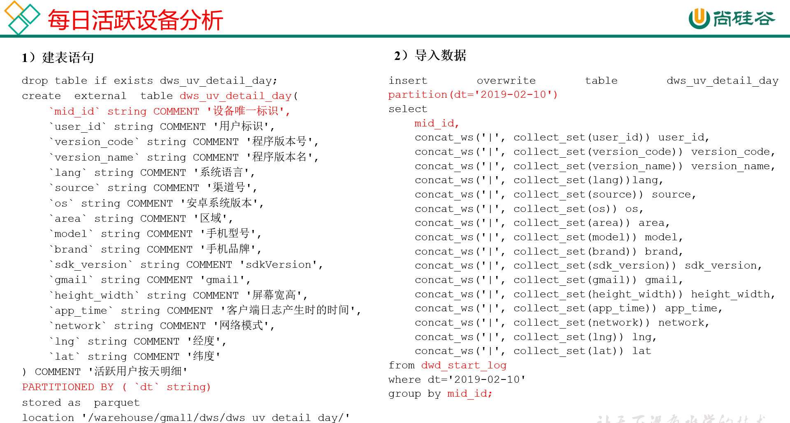

1. 建表语句

```sql
hive (gmall)>
drop table if exists dws_uv_detail_day;
create external table dws_uv_detail_day
(
    `mid_id` string COMMENT '设备唯一标识',
    `user_id` string COMMENT '用户标识', 
    `version_code` string COMMENT '程序版本号', 
    `version_name` string COMMENT '程序版本名', 
    `lang` string COMMENT '系统语言', 
    `source` string COMMENT '渠道号', 
    `os` string COMMENT '安卓系统版本', 
    `area` string COMMENT '区域', 
    `model` string COMMENT '手机型号', 
    `brand` string COMMENT '手机品牌', 
    `sdk_version` string COMMENT 'sdkVersion', 
    `gmail` string COMMENT 'gmail', 
    `height_width` string COMMENT '屏幕宽高',
    `app_time` string COMMENT '客户端日志产生时的时间',
    `network` string COMMENT '网络模式',
    `lng` string COMMENT '经度',
    `lat` string COMMENT '纬度'
)
partitioned by(dt string)
stored as parquet
location '/warehouse/gmall/dws/dws_uv_detail_day'
;

```

2. 导入数据

以用户单日访问为key进行聚合，如果某个用户在一天中使用了两种操作系统、两个系统版本、多个地区，登录不同账号，只取其中之一

```sql
hive (gmall)>
set hive.exec.dynamic.partition.mode=nonstrict;

insert overwrite table dws_uv_detail_day 
partition(dt='2019-02-10')
select  
    mid_id,
    concat_ws('|', collect_set(user_id)) user_id,
    concat_ws('|', collect_set(version_code)) version_code,
    concat_ws('|', collect_set(version_name)) version_name,
    concat_ws('|', collect_set(lang))lang,
    concat_ws('|', collect_set(source)) source,
    concat_ws('|', collect_set(os)) os,
    concat_ws('|', collect_set(area)) area, 
    concat_ws('|', collect_set(model)) model,
    concat_ws('|', collect_set(brand)) brand,
    concat_ws('|', collect_set(sdk_version)) sdk_version,
    concat_ws('|', collect_set(gmail)) gmail,
    concat_ws('|', collect_set(height_width)) height_width,
    concat_ws('|', collect_set(app_time)) app_time,
    concat_ws('|', collect_set(network)) network,
    concat_ws('|', collect_set(lng)) lng,
    concat_ws('|', collect_set(lat)) lat
from dwd_start_log
where dt='2019-02-10'
group by mid_id;

```

3. 查询结果

```sql
hive (gmall)> select * from dws_uv_detail_day limit 1;
hive (gmall)> select count(*) from dws_uv_detail_day;
```

### 6.1.1.2 每周活跃设备明细

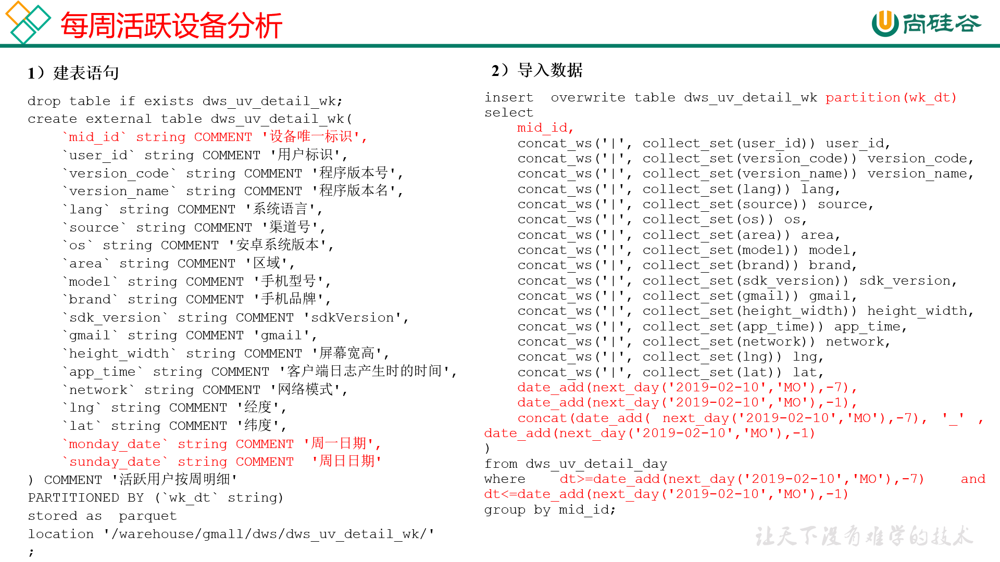

根据日用户访问明细，获得周用户访问明细。

1. 建表语句

```sql
hive (gmall)>
drop table if exists dws_uv_detail_day;
create external table dws_uv_detail_day
(
    `mid_id` string COMMENT '设备唯一标识',
    `user_id` string COMMENT '用户标识', 
    `version_code` string COMMENT '程序版本号', 
    `version_name` string COMMENT '程序版本名', 
    `lang` string COMMENT '系统语言', 
    `source` string COMMENT '渠道号', 
    `os` string COMMENT '安卓系统版本', 
    `area` string COMMENT '区域', 
    `model` string COMMENT '手机型号', 
    `brand` string COMMENT '手机品牌', 
    `sdk_version` string COMMENT 'sdkVersion', 
    `gmail` string COMMENT 'gmail', 
    `height_width` string COMMENT '屏幕宽高',
    `app_time` string COMMENT '客户端日志产生时的时间',
    `network` string COMMENT '网络模式',
    `lng` string COMMENT '经度',
    `lat` string COMMENT '纬度'
)
partitioned by(dt string)
stored as parquet
location '/warehouse/gmall/dws/dws_uv_detail_day'
;

```

2. 数据导入
以用户单日访问为key进行聚合，如果某个用户在一天中使用了两种操作系统、两个系统版本、多个地区，登录不同账号，只取其中之一

```sql
hive (gmall)>
set hive.exec.dynamic.partition.mode=nonstrict;

insert overwrite table dws_uv_detail_day 
partition(dt='2019-02-10')
select  
    mid_id,
    concat_ws('|', collect_set(user_id)) user_id,
    concat_ws('|', collect_set(version_code)) version_code,
    concat_ws('|', collect_set(version_name)) version_name,
    concat_ws('|', collect_set(lang))lang,
    concat_ws('|', collect_set(source)) source,
    concat_ws('|', collect_set(os)) os,
    concat_ws('|', collect_set(area)) area, 
    concat_ws('|', collect_set(model)) model,
    concat_ws('|', collect_set(brand)) brand,
    concat_ws('|', collect_set(sdk_version)) sdk_version,
    concat_ws('|', collect_set(gmail)) gmail,
    concat_ws('|', collect_set(height_width)) height_width,
    concat_ws('|', collect_set(app_time)) app_time,
    concat_ws('|', collect_set(network)) network,
    concat_ws('|', collect_set(lng)) lng,
    concat_ws('|', collect_set(lat)) lat
from dwd_start_log
where dt='2019-02-10'
group by mid_id;

```

3. 查询结果

```sql
hive (gmall)> select * from dws_uv_detail_day limit 1;
hive (gmall)> select count(*) from dws_uv_detail_day;

```

#### 6.1.1.3 每月活跃设备明细

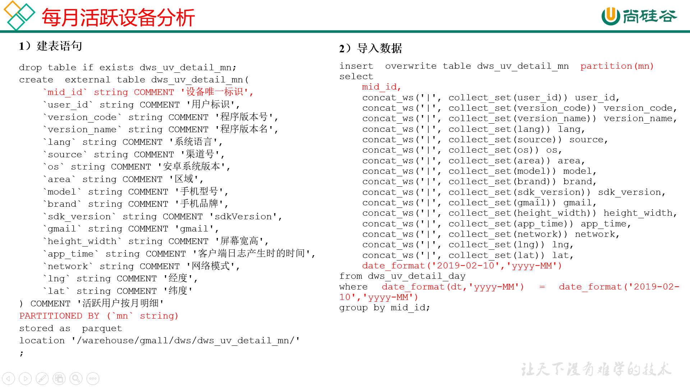

1. 建表语句

```sql
hive (gmall)>
drop table if exists dws_uv_detail_mn;

create external table dws_uv_detail_mn( 
    `mid_id` string COMMENT '设备唯一标识',
    `user_id` string COMMENT '用户标识', 
    `version_code` string COMMENT '程序版本号', 
    `version_name` string COMMENT '程序版本名', 
    `lang` string COMMENT '系统语言', 
    `source` string COMMENT '渠道号', 
    `os` string COMMENT '安卓系统版本', 
    `area` string COMMENT '区域', 
    `model` string COMMENT '手机型号', 
    `brand` string COMMENT '手机品牌', 
    `sdk_version` string COMMENT 'sdkVersion', 
    `gmail` string COMMENT 'gmail', 
    `height_width` string COMMENT '屏幕宽高',
    `app_time` string COMMENT '客户端日志产生时的时间',
    `network` string COMMENT '网络模式',
    `lng` string COMMENT '经度',
    `lat` string COMMENT '纬度'
) COMMENT '活跃用户按月明细'
PARTITIONED BY (`mn` string)
stored as parquet
location '/warehouse/gmall/dws/dws_uv_detail_mn/'
;

```

2. 导入数据

```sql
hive (gmall)>
set hive.exec.dynamic.partition.mode=nonstrict;

insert overwrite table dws_uv_detail_mn partition(mn)
select  
    mid_id,
    concat_ws('|', collect_set(user_id)) user_id,
    concat_ws('|', collect_set(version_code)) version_code,
    concat_ws('|', collect_set(version_name)) version_name,
    concat_ws('|', collect_set(lang)) lang,
    concat_ws('|', collect_set(source)) source,
    concat_ws('|', collect_set(os)) os,
    concat_ws('|', collect_set(area)) area, 
    concat_ws('|', collect_set(model)) model,
    concat_ws('|', collect_set(brand)) brand,
    concat_ws('|', collect_set(sdk_version)) sdk_version,
    concat_ws('|', collect_set(gmail)) gmail,
    concat_ws('|', collect_set(height_width)) height_width,
    concat_ws('|', collect_set(app_time)) app_time,
    concat_ws('|', collect_set(network)) network,
    concat_ws('|', collect_set(lng)) lng,
    concat_ws('|', collect_set(lat)) lat,
    date_format('2019-02-10','yyyy-MM')
from dws_uv_detail_day
where date_format(dt,'yyyy-MM') = date_format('2019-02-10','yyyy-MM')
group by mid_id;

```

3. 查询结果

```sql
hive (gmall)> select * from dws_uv_detail_mn limit 1;
hive (gmall)> select count(*) from dws_uv_detail_mn ;

```

### 6.1.1.4  DWS层加载数据脚本

1. 在hadoop102的/home/atguigu/bin目录下创建脚本
[atguigu@hadoop102 bin]$ vim dws_uv_log.sh

2. 在脚本中编写如下内容

```bash
#!/bin/bash

# 定义变量方便修改
APP=gmall
hive=/opt/module/hive/bin/hive

# 如果是输入的日期按照取输入日期；如果没输入日期取当前时间的前一天
if [ -n "$1" ] ;then
	do_date=$1
else 
	do_date=`date -d "-1 day" +%F`  
fi 


sql="
  set hive.exec.dynamic.partition.mode=nonstrict;

  insert overwrite table "$APP".dws_uv_detail_day partition(dt='$do_date')
  select  
    mid_id,
    concat_ws('|', collect_set(user_id)) user_id,
    concat_ws('|', collect_set(version_code)) version_code,
    concat_ws('|', collect_set(version_name)) version_name,
    concat_ws('|', collect_set(lang)) lang,
    concat_ws('|', collect_set(source)) source,
    concat_ws('|', collect_set(os)) os,
    concat_ws('|', collect_set(area)) area, 
    concat_ws('|', collect_set(model)) model,
    concat_ws('|', collect_set(brand)) brand,
    concat_ws('|', collect_set(sdk_version)) sdk_version,
    concat_ws('|', collect_set(gmail)) gmail,
    concat_ws('|', collect_set(height_width)) height_width,
    concat_ws('|', collect_set(app_time)) app_time,
    concat_ws('|', collect_set(network)) network,
    concat_ws('|', collect_set(lng)) lng,
    concat_ws('|', collect_set(lat)) lat
  from "$APP".dwd_start_log
  where dt='$do_date'  
  group by mid_id;


  insert overwrite table "$APP".dws_uv_detail_wk partition(wk_dt)
  select  
    mid_id,
    concat_ws('|', collect_set(user_id)) user_id,
    concat_ws('|', collect_set(version_code)) version_code,
    concat_ws('|', collect_set(version_name)) version_name,
    concat_ws('|', collect_set(lang)) lang,
    concat_ws('|', collect_set(source)) source,
    concat_ws('|', collect_set(os)) os,
    concat_ws('|', collect_set(area)) area, 
    concat_ws('|', collect_set(model)) model,
    concat_ws('|', collect_set(brand)) brand,
    concat_ws('|', collect_set(sdk_version)) sdk_version,
    concat_ws('|', collect_set(gmail)) gmail,
    concat_ws('|', collect_set(height_width)) height_width,
    concat_ws('|', collect_set(app_time)) app_time,
    concat_ws('|', collect_set(network)) network,
    concat_ws('|', collect_set(lng)) lng,
    concat_ws('|', collect_set(lat)) lat,
    date_add(next_day('$do_date','MO'),-7),
    date_add(next_day('$do_date','MO'),-1),
    concat(date_add( next_day('$do_date','MO'),-7), '_' , date_add(next_day('$do_date','MO'),-1) 
  )
  from "$APP".dws_uv_detail_day
  where dt>=date_add(next_day('$do_date','MO'),-7) and dt<=date_add(next_day('$do_date','MO'),-1) 
  group by mid_id; 


  insert overwrite table "$APP".dws_uv_detail_mn partition(mn)
  select
    mid_id,
    concat_ws('|', collect_set(user_id)) user_id,
    concat_ws('|', collect_set(version_code)) version_code,
    concat_ws('|', collect_set(version_name)) version_name,
    concat_ws('|', collect_set(lang))lang,
    concat_ws('|', collect_set(source)) source,
    concat_ws('|', collect_set(os)) os,
    concat_ws('|', collect_set(area)) area, 
    concat_ws('|', collect_set(model)) model,
    concat_ws('|', collect_set(brand)) brand,
    concat_ws('|', collect_set(sdk_version)) sdk_version,
    concat_ws('|', collect_set(gmail)) gmail,
    concat_ws('|', collect_set(height_width)) height_width,
    concat_ws('|', collect_set(app_time)) app_time,
    concat_ws('|', collect_set(network)) network,
    concat_ws('|', collect_set(lng)) lng,
    concat_ws('|', collect_set(lat)) lat,
    date_format('$do_date','yyyy-MM')
  from "$APP".dws_uv_detail_day
  where date_format(dt,'yyyy-MM') = date_format('$do_date','yyyy-MM')   
  group by mid_id;
"

$hive -e "$sql"
```

3. 增加脚本执行权限

`[atguigu@hadoop102 bin]$ chmod 777 dws_uv_log.sh`

4. 脚本使用

`[atguigu@hadoop102 module]$ dws_uv_log.sh 2019-02-11`

5. 查询结果

```sql
hive (gmall)> select count(*) from dws_uv_detail_day where dt='2019-02-11';
hive (gmall)> select count(*) from dws_uv_detail_wk;
hive (gmall)> select count(*) from dws_uv_detail_mn ;

```

6. 脚本执行时间

企业开发中一般在每日凌晨30分~1点


### 6.1.2 ADS 层

目标：当日、当周、当月活跃设备数

### 6.1.2.1 活跃设备数

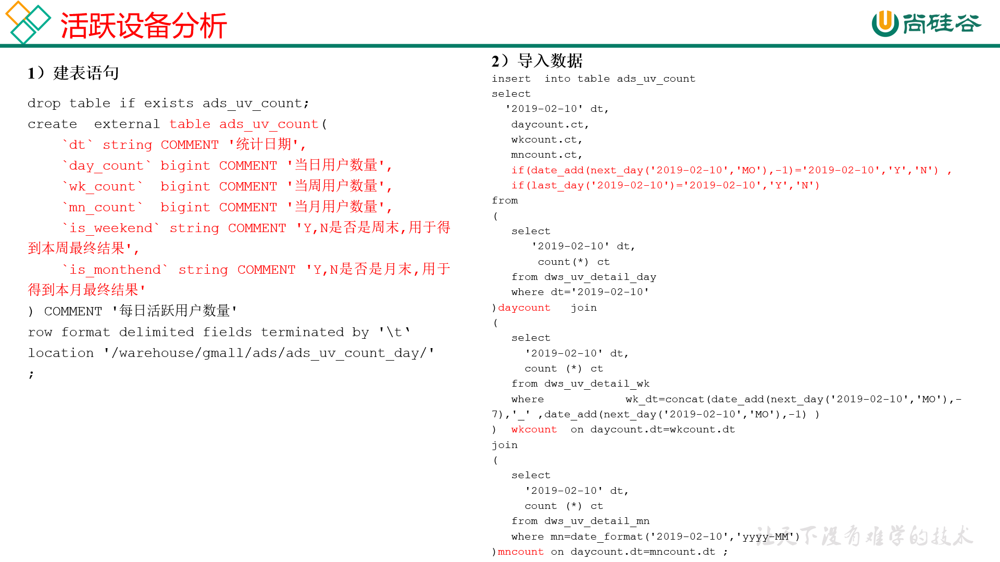

1. 建表语句

```sql
hive (gmall)>
drop table if exists ads_uv_count;
create external table ads_uv_count( 
    `dt` string COMMENT '统计日期',
    `day_count` bigint COMMENT '当日用户数量',
    `wk_count`  bigint COMMENT '当周用户数量',
    `mn_count`  bigint COMMENT '当月用户数量',
    `is_weekend` string COMMENT 'Y,N是否是周末,用于得到本周最终结果',
    `is_monthend` string COMMENT 'Y,N是否是月末,用于得到本月最终结果' 
) COMMENT '活跃设备数'
row format delimited fields terminated by '\t'
location '/warehouse/gmall/ads/ads_uv_count/'
;

```

2. 导入数据

```sql
hive (gmall)>
insert into table ads_uv_count 
select  
  '2019-02-10' dt,
   daycount.ct,
   wkcount.ct,
   mncount.ct,
   if(date_add(next_day('2019-02-10','MO'),-1)='2019-02-10','Y','N') ,
   if(last_day('2019-02-10')='2019-02-10','Y','N') 
from 
(
   select  
      '2019-02-10' dt,
       count(*) ct
   from dws_uv_detail_day
   where dt='2019-02-10'  
)daycount join 
( 
   select  
     '2019-02-10' dt,
     count (*) ct
   from dws_uv_detail_wk
   where wk_dt=concat(date_add(next_day('2019-02-10','MO'),-7),'_' ,date_add(next_day('2019-02-10','MO'),-1) )
) wkcount on daycount.dt=wkcount.dt
join 
( 
   select  
     '2019-02-10' dt,
     count (*) ct
   from dws_uv_detail_mn
   where mn=date_format('2019-02-10','yyyy-MM')  
)mncount on daycount.dt=mncount.dt
;

```

3. 查询结果

```sql
hive (gmall)> select * from ads_uv_count ;
```

#### 6.1.2.2 ADS层加载数据脚本

1. 在hadoop102的/home/atguigu/bin目录下创建脚本

`[atguigu@hadoop102 bin]$ vim ads_uv_log.sh`

2. 在脚本中编写如下内容

```bash

#!/bin/bash

# 定义变量方便修改
APP=gmall
hive=/opt/module/hive/bin/hive

# 如果是输入的日期按照取输入日期；如果没输入日期取当前时间的前一天
if [ -n "$1" ] ;then
	do_date=$1
else 
	do_date=`date -d "-1 day" +%F`  
fi 

sql="
  set hive.exec.dynamic.partition.mode=nonstrict;

insert into table "$APP".ads_uv_count 
select  
  '$do_date' dt,
   daycount.ct,
   wkcount.ct,
   mncount.ct,
   if(date_add(next_day('$do_date','MO'),-1)='$do_date','Y','N') ,
   if(last_day('$do_date')='$do_date','Y','N') 
from 
(
   select  
      '$do_date' dt,
       count(*) ct
   from "$APP".dws_uv_detail_day
   where dt='$do_date'  
)daycount   join 
( 
   select  
     '$do_date' dt,
     count (*) ct
   from "$APP".dws_uv_detail_wk
   where wk_dt=concat(date_add(next_day('$do_date','MO'),-7),'_' ,date_add(next_day('$do_date','MO'),-1) )
)  wkcount  on daycount.dt=wkcount.dt
join 
( 
   select  
     '$do_date' dt,
     count (*) ct
   from "$APP".dws_uv_detail_mn
   where mn=date_format('$do_date','yyyy-MM')  
)mncount on daycount.dt=mncount.dt;
"

$hive -e "$sql"
```

3. 增加脚本执行权限

`[atguigu@hadoop102 bin]$ chmod 777 ads_uv_log.sh`

4. 脚本使用

`[atguigu@hadoop102 module]$ ads_uv_log.sh 2019-02-11`

5. 查询结果

```sql
hive (gmall)> select * from ads_uv_count;
```

6. 脚本执行时间

企业开发中一般在每日凌晨30分~1点


------------

-------------


## 7.2 需求二：用户新增主题

首次联网使用应用的用户。如果一个用户首次打开某APP，那这个用户定义为新增用户；卸载再安装的设备，不会被算作一次新增。新增用户包括日新增用户、周新增用户、月新增用户。


### 7.2.1 DWS层（每日新增设备明细表）

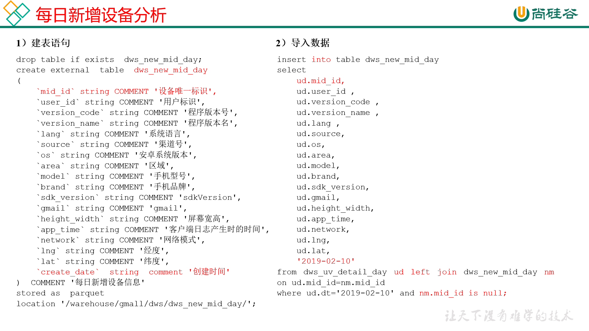

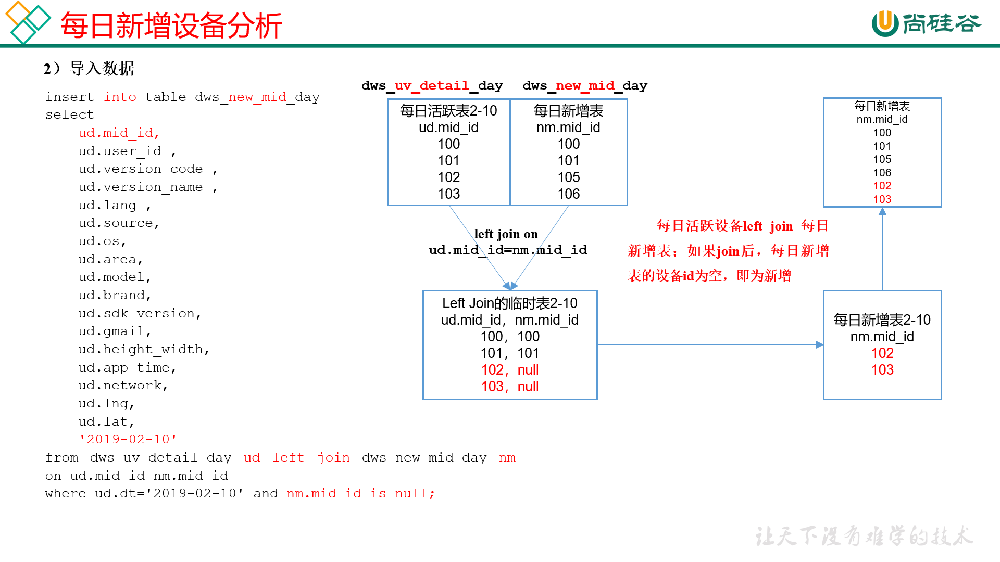

1. 建表查询

```sql
hive (gmall)>
drop table if exists dws_new_mid_day;
create external table dws_new_mid_day
(
    `mid_id` string COMMENT '设备唯一标识',
    `user_id` string COMMENT '用户标识', 
    `version_code` string COMMENT '程序版本号', 
    `version_name` string COMMENT '程序版本名', 
    `lang` string COMMENT '系统语言', 
    `source` string COMMENT '渠道号', 
    `os` string COMMENT '安卓系统版本', 
    `area` string COMMENT '区域', 
    `model` string COMMENT '手机型号', 
    `brand` string COMMENT '手机品牌', 
    `sdk_version` string COMMENT 'sdkVersion', 
    `gmail` string COMMENT 'gmail', 
    `height_width` string COMMENT '屏幕宽高',
    `app_time` string COMMENT '客户端日志产生时的时间',
    `network` string COMMENT '网络模式',
    `lng` string COMMENT '经度',
    `lat` string COMMENT '纬度',
    `create_date`  string  comment '创建时间' 
)  COMMENT '每日新增设备信息'
stored as parquet
location '/warehouse/gmall/dws/dws_new_mid_day/';

```

2. 导入数据

用每日活跃用户表Left Join每日新增设备表，关联的条件是mid_id相等。如果是每日新增的设备，则在每日新增设备表中为null。

```sql
hive (gmall)>
insert into table dws_new_mid_day
select  
    ud.mid_id,
    ud.user_id , 
    ud.version_code , 
    ud.version_name , 
    ud.lang , 
    ud.source, 
    ud.os, 
    ud.area, 
    ud.model, 
    ud.brand, 
    ud.sdk_version, 
    ud.gmail, 
    ud.height_width,
    ud.app_time,
    ud.network,
    ud.lng,
    ud.lat,
    '2019-02-10'
from dws_uv_detail_day ud left join dws_new_mid_day nm on ud.mid_id=nm.mid_id
where ud.dt='2019-02-10' and nm.mid_id is null;
```

3. 查询结果

```sql
hive (gmall)> select count(*) from dws_new_mid_day ;
```


### 6.2.2 ADS层（每日新增设备表）

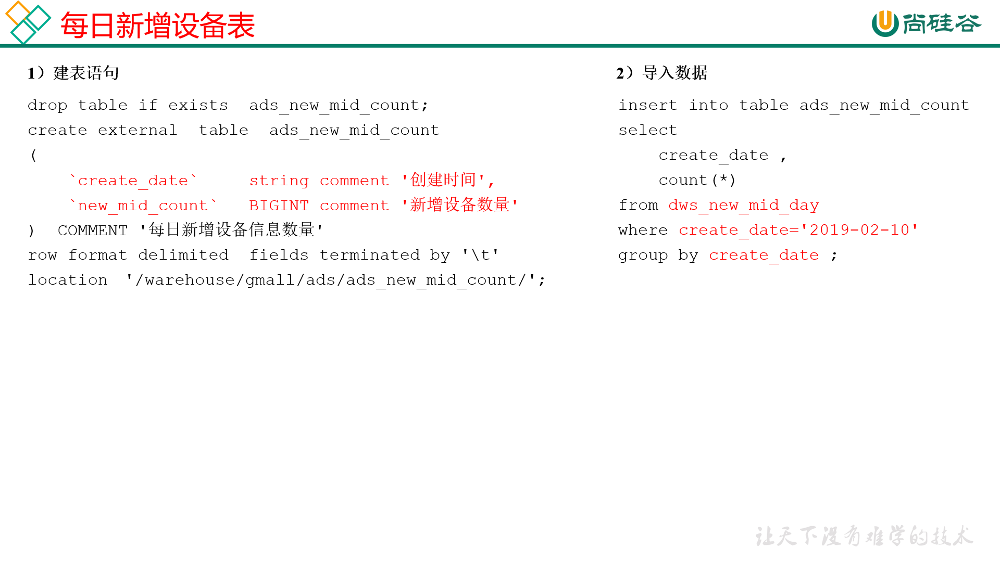

1. 建表语句

```sql
hive (gmall)>
drop table if exists ads_new_mid_count;
create external table ads_new_mid_count
(
    `create_date`     string comment '创建时间' ,
    `new_mid_count`   BIGINT comment '新增设备数量' 
)  COMMENT '每日新增设备信息数量'
row format delimited fields terminated by '\t'
location '/warehouse/gmall/ads/ads_new_mid_count/';

```

2. 导入数据

```sql
hive (gmall)>
insert into table ads_new_mid_count 
select
create_date,
count(*)
from dws_new_mid_day
where create_date='2019-02-10'
group by create_date;

```

3. 查询结果

```sql
hive (gmall)> select * from ads_new_mid_count;
```

## 6.3 需求三：用户留存主题

### 6.3.1 需求目标

#### 6.3.1.1 用户留存概念

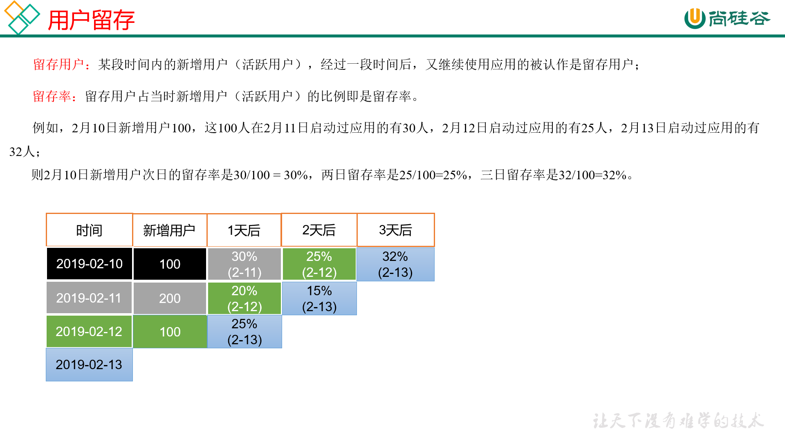

#### 6.3.1.2 需求描述

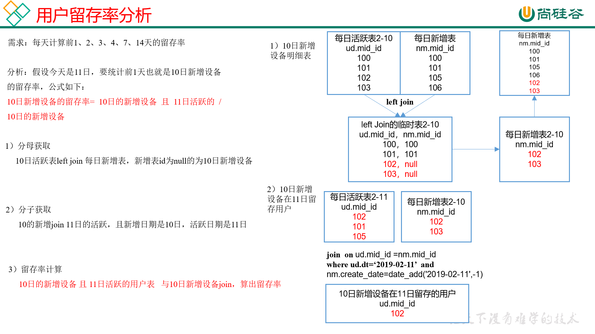

### 6.3.2 DWS层

#### 6.3.2.1 DWS 层（每日留存用户明细表）

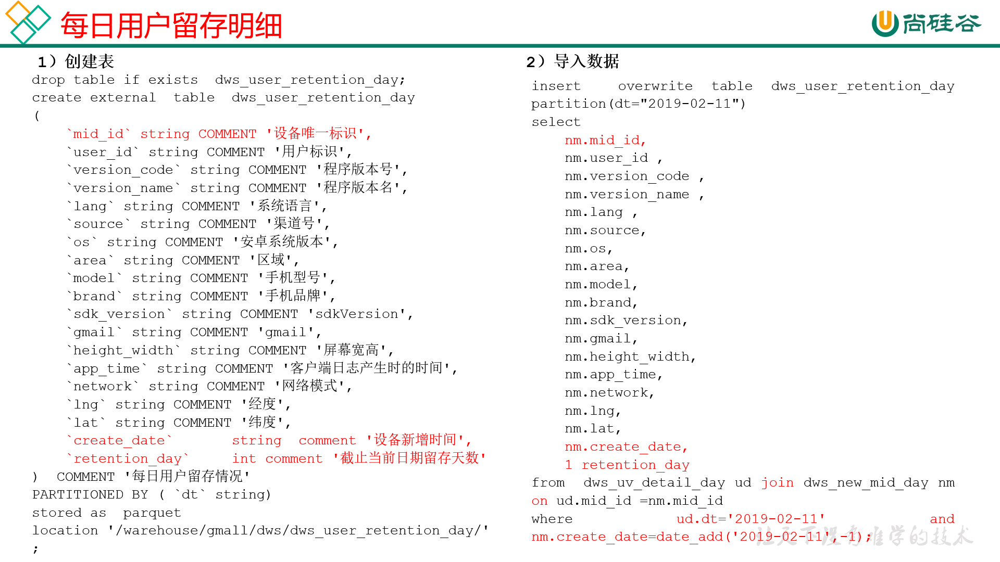

1. 建表语句

```sql
hive (gmall)>
drop table if exists dws_user_retention_day;
create external table dws_user_retention_day 
(
    `mid_id` string COMMENT '设备唯一标识',
    `user_id` string COMMENT '用户标识', 
    `version_code` string COMMENT '程序版本号', 
    `version_name` string COMMENT '程序版本名', 
`lang` string COMMENT '系统语言', 
`source` string COMMENT '渠道号', 
`os` string COMMENT '安卓系统版本', 
`area` string COMMENT '区域', 
`model` string COMMENT '手机型号', 
`brand` string COMMENT '手机品牌', 
`sdk_version` string COMMENT 'sdkVersion', 
`gmail` string COMMENT 'gmail', 
`height_width` string COMMENT '屏幕宽高',
`app_time` string COMMENT '客户端日志产生时的时间',
`network` string COMMENT '网络模式',
`lng` string COMMENT '经度',
`lat` string COMMENT '纬度',
   `create_date`    string  comment '设备新增时间',
   `retention_day`  int comment '截止当前日期留存天数'
)  COMMENT '每日用户留存情况'
PARTITIONED BY (`dt` string)
stored as parquet
location '/warehouse/gmall/dws/dws_user_retention_day/'
;

```

2. 导入数据（每天计算前1天的新用户访问留存明细）

```sql
hive (gmall)>
insert overwrite table dws_user_retention_day
partition(dt="2019-02-11")
select  
    nm.mid_id,
    nm.user_id , 
    nm.version_code , 
    nm.version_name , 
    nm.lang , 
    nm.source, 
    nm.os, 
    nm.area, 
    nm.model, 
    nm.brand, 
    nm.sdk_version, 
    nm.gmail, 
    nm.height_width,
    nm.app_time,
    nm.network,
    nm.lng,
    nm.lat,
nm.create_date,
1 retention_day 
from dws_uv_detail_day ud join dws_new_mid_day nm   on ud.mid_id =nm.mid_id 
where ud.dt='2019-02-11' and nm.create_date=date_add('2019-02-11',-1);

```

3. 查询结果（每天计算前1天的新用户访问留存明细）

```sql
hive (gmall)> select count(*) from dws_user_retention_day;
```

#### 6.3.2.2 DWS层（1,2,3,n天留存用户明细表）

1. 导入数据（每天计算前1,2,3，n天的新用户访问留存明细）

```sql
hive (gmall)>
insert overwrite table dws_user_retention_day
partition(dt="2019-02-11")
select
    nm.mid_id,
    nm.user_id,
    nm.version_code,
    nm.version_name,
    nm.lang,
    nm.source,
    nm.os,
    nm.area,
    nm.model,
    nm.brand,
    nm.sdk_version,
    nm.gmail,
    nm.height_width,
    nm.app_time,
    nm.network,
    nm.lng,
    nm.lat,
    nm.create_date,
    1 retention_day 
from dws_uv_detail_day ud join dws_new_mid_day nm  on ud.mid_id =nm.mid_id 
where ud.dt='2019-02-11' and nm.create_date=date_add('2019-02-11',-1)

union all
select  
    nm.mid_id,
    nm.user_id , 
    nm.version_code , 
    nm.version_name , 
    nm.lang , 
    nm.source, 
    nm.os, 
    nm.area, 
    nm.model, 
    nm.brand, 
    nm.sdk_version, 
    nm.gmail, 
    nm.height_width,
    nm.app_time,
    nm.network,
    nm.lng,
    nm.lat,
    nm.create_date,
    2 retention_day 
from  dws_uv_detail_day ud join dws_new_mid_day nm   on ud.mid_id =nm.mid_id 
where ud.dt='2019-02-11' and nm.create_date=date_add('2019-02-11',-2)

union all
select  
    nm.mid_id,
    nm.user_id , 
    nm.version_code , 
    nm.version_name , 
    nm.lang , 
    nm.source, 
    nm.os, 
    nm.area, 
    nm.model, 
    nm.brand, 
    nm.sdk_version, 
    nm.gmail, 
    nm.height_width,
    nm.app_time,
    nm.network,
    nm.lng,
    nm.lat,
    nm.create_date,
    3 retention_day 
from  dws_uv_detail_day ud join dws_new_mid_day nm   on ud.mid_id =nm.mid_id 
where ud.dt='2019-02-11' and nm.create_date=date_add('2019-02-11',-3);

```

2. 查询导入数据（每天计算前1,2,3天的新用户访问留存明细）

#### 6.3.2.3 Union与Union all区别

1）准备两张表

```
tableA			                  tableB
id　　name　　score             id　　name　　score
1　　　a　　　　80               1　　  d　　　　48
2　　  b　　　　79               2　　　e　　　　23
3　　  c　　  　68               3　　　c　　　　86
```

2）采用union查询

```sql
select name from tableA　　　　　　　　　　　　　
union　　　　　　　　　　　　　　　　　　　　　　　　
select name from tableB　　　　　　　　　　　　　
查询结果
name
a
d
b
e
c
```

3）采用union all查询

```sql
select name from tableA
union all
select name from tableB
查询结果
name
a
b
c
d
e
c
```

4）总结
（1）union会将联合的结果集去重，效率较union all差
（2）union all不会对结果集去重，所以效率高


### 6.3.3 ADS 层

#### 6.3.3.1 留存用户数

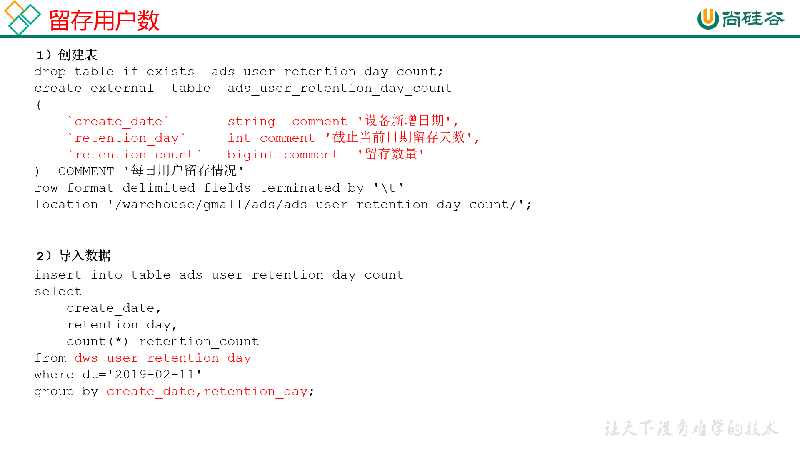

1. 建表语句

```sql
hive (gmall)>
drop table if exists ads_user_retention_day_count;
create external table ads_user_retention_day_count 
(
   `create_date`       string  comment '设备新增日期',
   `retention_day`     int comment '截止当前日期留存天数',
   `retention_count`    bigint comment  '留存数量'
)  COMMENT '每日用户留存情况'
row format delimited fields terminated by '\t'
location '/warehouse/gmall/ads/ads_user_retention_day_count/';
```

2. 导入数据

```sql
hive (gmall)>
insert into table ads_user_retention_day_count 
select
    create_date,
    retention_day,
    count(*) retention_count
from dws_user_retention_day
where dt='2019-02-11' 
group by create_date,retention_day;
```

3. 查询结果

```sql
hive (gmall)> select * from ads_user_retention_day_count;
```

#### 6.3.3.2 留存用户比率

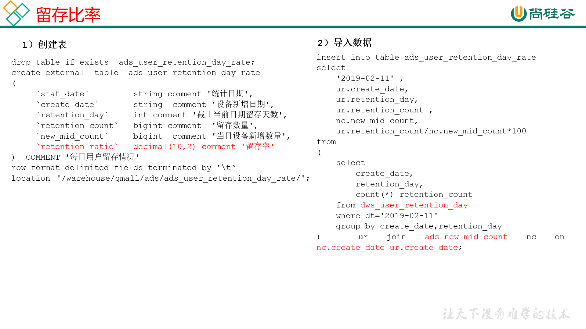

1. 建表语句

```sql
hive (gmall)>
drop table if exists ads_user_retention_day_rate;
create external table ads_user_retention_day_rate 
(
     `stat_date`          string comment '统计日期',
     `create_date`       string  comment '设备新增日期',
     `retention_day`     int comment '截止当前日期留存天数',
     `retention_count`    bigint comment  '留存数量',
     `new_mid_count`     bigint comment '当日设备新增数量',
     `retention_ratio`   decimal(10,2) comment '留存率'
)  COMMENT '每日用户留存情况'
row format delimited fields terminated by '\t'
location '/warehouse/gmall/ads/ads_user_retention_day_rate/';

```

2. 导入数据

```sql
hive (gmall)>
insert into table ads_user_retention_day_rate
select 
    '2019-02-11', 
    ur.create_date,
    ur.retention_day, 
    ur.retention_count, 
    nc.new_mid_count,
    ur.retention_count/nc.new_mid_count*100
from 
(
    select
        create_date,
        retention_day,
        count(*) retention_count
    from dws_user_retention_day
    where dt='2019-02-11' 
    group by create_date,retention_day
) ur join ads_new_mid_count nc on nc.create_date=ur.create_date;
```

3. 查询结果

```sql
hive (gmall)>select * from ads_user_retention_day_rate;
```

## 6.4 新数据准备

为了分析沉默用户、本周回流用户数、流失用户、最近连续3周活跃用户、最近七天内连续三天活跃用户数，需要准备2019-02-12、2019-02-20日的数据。

1. 2019-02-12数据准备
（1）修改日志时间
`[atguigu@hadoop102 ~]$ dt.sh 2019-02-12`
（2）启动集群
`[atguigu@hadoop102 ~]$ cluster.sh start`
（3）生成日志数据
`[atguigu@hadoop102 ~]$ lg.sh`
（4）将HDFS数据导入到ODS层
`[atguigu@hadoop102 ~]$ ods_log.sh 2019-02-12`
（5）将ODS数据导入到DWD层
`[atguigu@hadoop102 ~]$ dwd_start_log.sh 2019-02-12`
`[atguigu@hadoop102 ~]$ dwd_base_log.sh 2019-02-12`
`[atguigu@hadoop102 ~]$ dwd_event_log.sh 2019-02-12`
（6）将DWD数据导入到DWS层
`[atguigu@hadoop102 ~]$ dws_uv_log.sh 2019-02-12`
（7）验证
```sql
hive (gmall)> select * from dws_uv_detail_day where dt='2019-02-12' limit 2;
```
2）2019-02-20数据准备
（1）修改日志时间
`[atguigu@hadoop102 ~]$ dt.sh 2019-02-20`
（2）启动集群
`[atguigu@hadoop102 ~]$ cluster.sh start`
（3）生成日志数据
`[atguigu@hadoop102 ~]$ lg.sh`
（4）将HDFS数据导入到ODS层
`[atguigu@hadoop102 ~]$ ods_log.sh 2019-02-20`
（5）将ODS数据导入到DWD层
`[atguigu@hadoop102 ~]$ dwd_start_log.sh 2019-02-20`
`[atguigu@hadoop102 ~]$ dwd_base_log.sh 2019-02-20`
`[atguigu@hadoop102 ~]$ dwd_event_log.sh 2019-02-20`
（6）将DWD数据导入到DWS层
`[atguigu@hadoop102 ~]$ dws_uv_log.sh 2019-02-20`
（7）验证
```sql
hive (gmall)> select * from dws_uv_detail_day where dt='2019-02-20' limit 2;
```

## 6.4 需求四：沉默用户数

沉默用户：指的是只在安装当天启动过，且启动时间是在一周前

### 6.4.1 DWS层

使用日活明细表dws_uv_detail_day作为DWS层数据

### 6.4.2 ADS层

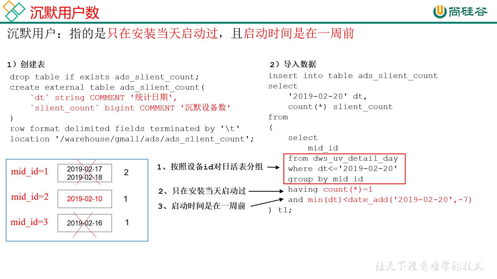

1. 建表语句

```sql
hive (gmall)>
drop table if exists ads_slient_count;
create external table ads_slient_count( 
    `dt` string COMMENT '统计日期',
    `slient_count` bigint COMMENT '沉默设备数'
) 
row format delimited fields terminated by '\t'
location '/warehouse/gmall/ads/ads_slient_count';

```

2. 导入数据

```sql
hive (gmall)>
insert into table ads_slient_count
select 
    '2019-02-20' dt,
    count(*) slient_count
from 
(
    select mid_id
    from dws_uv_detail_day
    where dt<='2019-02-20'
    group by mid_id
    having count(*)=1 and min(dt)<date_add('2019-02-20',-7)
) t1;

```

3. 查询结果

```sql
hive (gmall)> select * from ads_slient_count;
```


### 6.4.3 编写脚本

1. 在hadoop102的/home/atguigu/bin目录下创建脚本

`[atguigu@hadoop102 bin]$ vim ads_slient_log.sh`

2. 编写脚本

```bash
#!/bin/bash

hive=/opt/module/hive/bin/hive
APP=gmall

if [ -n "$1" ];then
	do_date=$1
else
	do_date=`date -d "-1 day" +%F`
fi

echo "-----------导入日期$do_date-----------"

sql="
insert into table "$APP".ads_slient_count
select 
    '$do_date' dt,
    count(*) slient_count
from 
(
    select 
        mid_id
    from "$APP".dws_uv_detail_day
    where dt<='$do_date'
    group by mid_id
    having count(*)=1 and min(dt)<=date_add('$do_date',-7)
)t1;"

$hive -e "$sql"

```

3. 增加脚本执行权限

`[atguigu@hadoop102 bin]$ chmod 777 ads_slient_log.sh`

4. 脚本使用

`[atguigu@hadoop102 module]$ ads_slient_log.sh 2019-02-20`

5. 脚本执行时间

企业开发中一般在每日凌晨30分~1点

## 6.5 需求五：本周回流用户数

//TODO 6.5 需求五：本周回流用户数

## 6.6 需求六：流失用户数

//TODO 6.6 需求六：流失用户数

## 6.7 需求七：最近连续3周活跃用户数

//TODO 6.7 需求七：最近连续3周活跃用户数

## 6.8 需求八：最近七天内连续三天活跃用户数

//TODO 6.8 需求八：最近七天内连续三天活跃用户数

