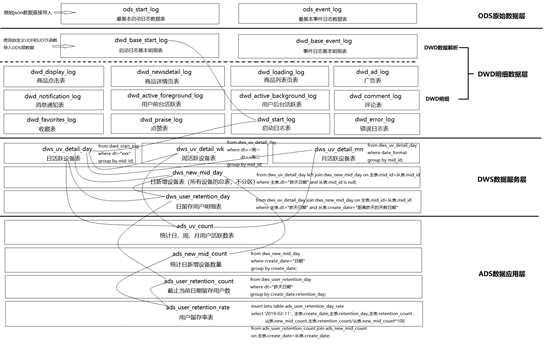
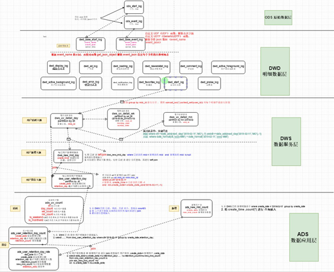

# 06. 总结

## 6.1 用户行为数仓业务总结

### 6.1.1 数仓分几层？每层做什么的？

1. ODS层（原始数据层）
存储原始数据，直接加载原始日志、数据，数据保持原貌不做处理。
2. DWD层（明细层）
对ODS层数据进行清洗（去除空值、脏数据，超过极限范围的数据）
3. DWS层（服务数据层）
以DWD层为基础，进行轻度汇总。比如：用户当日、设备当日、商品当日。
4. ADS层（数据应用层）

### 6.1.2 Tez引擎优点？

Tez可以将多个有依赖的作业转换为一个作业，这样只需写一次HDFS，且中间节点较少，从而大大提升作业的计算性能。

### 6.1.3 在项目中是否自定义过UDF、UDTF函数，以及用他们处理了什么问题？

自定义过。
用UDF函数解析公共字段；用UDTF函数解析事件字段。

### 6.1.4 如何分析用户活跃？

在启动日志中统计不同设备id 出现次数。

### 6.1.5 如何分析用户新增？

用活跃用户表 left join 用户新增表，用户新增表中mid为空的即为用户新增。

### 6.1.6 如何分析用户1天留存？

留存用户=前一天新增 join 今天活跃
用户留存率=留存用户/前一天新增

### 6.1.7 如何分析沉默用户？

按照设备id对日活表分组，登录次数为1，且是在一周前登录。

### 6.1.8 如何分析本周回流用户？

本周活跃left join本周新增 left join上周活跃，且本周新增id和上周活跃id都为null

### 6.1.9 如何分析流失用户？

按照设备id对日活表分组，且七天内没有登录过。

### 6.1.10 如何分析最近连续3周活跃用户数？

按照设备id对周活进行分组，统计次数大于3次。

### 6.1.11 如何分析最近七天内连续三天活跃用户数？

1. 查询出最近7天的活跃用户，并对用户活跃日期进行排名
2. 计算用户活跃日期及排名之间的差值
3. 对同用户及差值分组，统计差值个数
4. 将差值相同个数大于等于3的数据取出，然后去重，即为连续3天及以上活跃的用户

### 6.1.12 整个文档中涉及的所有层级及表

http://app.liuchengtu.com/#Rb734cafbf09d4651caadd74e5a3d304d

## 6.2 Hive 总结

//TODO 6.2 Hive 总结