# 01. 电商业务与数据结构

## 1.1 电商业务流程

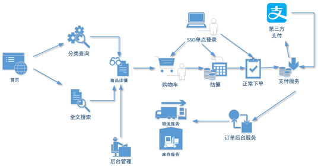

## 1.2 电商常识（SKU、 SPU）

SKU=Stock Keeping Unit（库存量基本单位）。现在已经被引申为产品统一编号的简称，每种产品均对应有唯一的SKU号。

SPU(Standard Product Unit)：是商品信息聚合的最小单位，是一组可复用、易检索的标准化信息集合。

比如，咱们购买一台iPhoneX手机，iPhoneX手机就是一个SPU，但是你购买的时候，不可能是以iPhoneX手机为单位买的，商家也不可能以iPhoneX为单位记录库存SKU。必须要以什么颜色什么版本的iPhoneX为单位。比如，你购买的是一台银色、128G内存的、支持联通网络的iPhoneX，商家也会以这个单位来记录库存数。那这个更细致的单位就叫库存单元（SKU）。

那SPU又是干什么的呢？

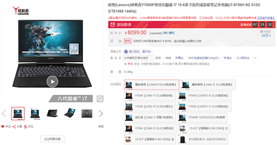

SPU表示一类商品。好处就是：可以共用商品图片，海报、销售属性等。

## 1.3 电商表结构

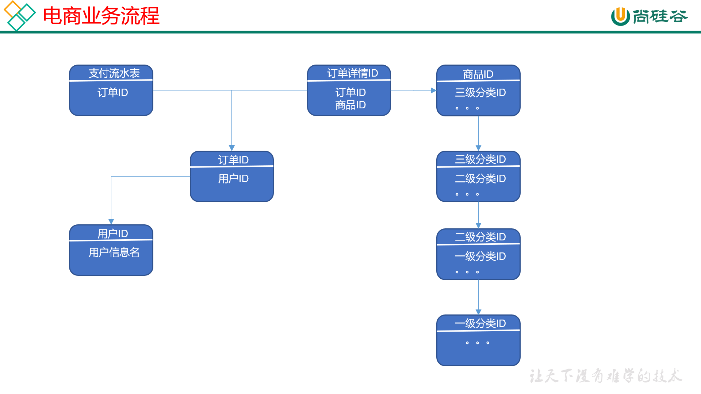

### 1.3.1 订单表（order_info）

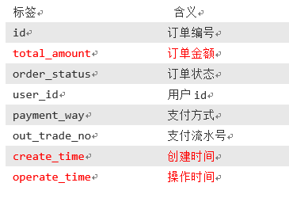

### 1.3.2 订单详情表（order_detail）

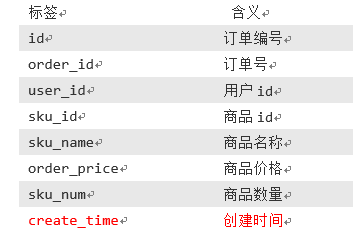

### 1.3.3 商品表

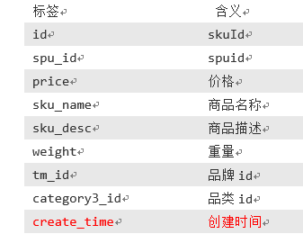

### 1.3.4 用户表

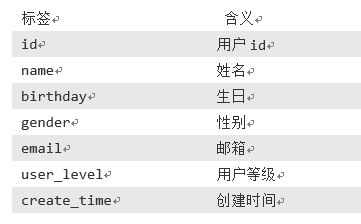

### 1.3.5 商品一级分类表

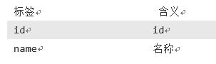

### 1.3.6 商品二级分类表

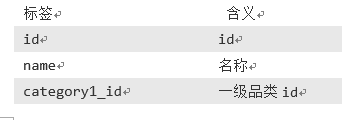

### 1.3.7 商品三级分类表

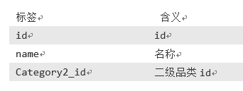

### 1.3.8 支付流水表

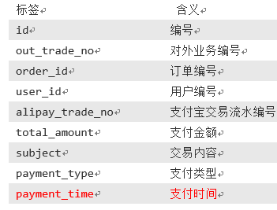
